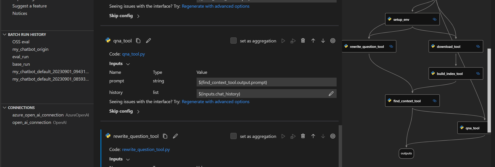
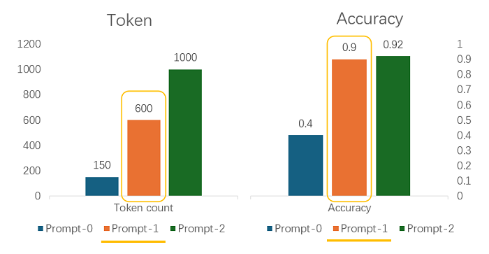

# Prompt flow


[](https://pypi.org/project/promptflow/)
[](https://github.com/microsoft/promptflow/blob/main/LICENSE)

<h2>Facilitate high quality LLM-native apps to production</h2>

> Welcome to join us to make Prompt flow!

[Documentacion](https://expert-adventure-197jp7v.pages.github.io/) • [Quick Start](https://github.com/microsoft/promptflow/blob/main/docs/how-to-guides/quick-start.md)  • [Discord](https://discord.gg/YyYYRwkq) •  [Discussions](https://github.com/microsoft/promptflow/discussions) • [Issues](https://github.com/microsoft/promptflow/issues/new/choose) • [Contribute PRs](https://github.com/microsoft/promptflow/pulls).

**Prompt flow** is a suite of development tools designed to streamline the end-to-end development cycle of LLM-based AI applications, from ideation, prototyping, testing, evaluation to production deployment and monitoring. It makes prompt engineering much easier and enables you to build LLM apps with production quality.

With prompt flow, you will be able to:

- **LLM-native apps power workflow**
    - Create executable workflows that link LLMs, prompts, Python code and other tools together.
    - Debug and iterate your flows, especially the interaction with LLMs with ease.
- **Facilitate high quality in development cycle**
    - Evaluate your flow's quality and performance with larger datasets.
    - Integrate the testing and evaluation into your CI/CD system to ensure quality of your flow.
    - Deploy your flow to the serving platform you choose or integrate into your app's code base easily.
- **Enterprise security and scalability**
    - (Optional but highly recommended) Collaborate with your team by leveraging the cloud version of [Prompt flow in Azure AI](https://learn.microsoft.com/en-us/azure/machine-learning/prompt-flow/overview-what-is-prompt-flow?view=azureml-api-2).

------

## Get Started with Prompt flow ⚡

### Installation

A python environment, `python=3.9` is recommended.

```sh
pip install promptflow promptflow-tools
```

(Optional to install) Prompt flow VS Code extension - Flow Designer

Prompt flow provide an extension in VS code for visualizing and editing your flows. You can search it in VS code extension marketplace to install.



### Create the connection to store your OpenAI API key

Prompt flow offers a **safe** way to manage credentials or secrets for LLM APIs, that is **Connection**!

Assuming you have already stored your OpenAI API key in a local environment variable named "OPENAI_API_KEY" within a `.env` file, you can effortlessly convert it into a Prompt flow connection by executing the following command in your terminal:

```sh
pf connection create -f .env --name open_ai_connection
```

In case you haven't set up the environment variable yet, don't worry! You can refer to [how to create a connection]() from scratch.

### Initialize a prompt flow from template

```sh
pf flow init --flow my_chatbot --type chat
```

This command will create a new **flow folder** named "my_chatbot" using the "chat" template.

Prompt flow currently supports three types of flow templates: `standard` (default), `chat`(suitable for chat scenarios) and `evaluation`(suitable for evaluation purposes). [More flow samples](examples/flows)

### Quick test your flow

Open the `flow.dag.yaml` file in the "my_chatbot" flow folder, specify the connection name you created in the previous step in the `connection` field, specify the model name in the `model` field, for example:

```yaml
  ......
  inputs:
    chat_history: ${inputs.chat_history}
    max_tokens: 256
    question: ${inputs.question}
    temperature: 0
    model: gpt-3.5-turbo
  connection: open_ai_connection
  ......
```

Now you want the flow to answer a math question correctly. Open the `chat.jinia2` file in the folder, replace the **system prompt** with the following prompt:

```jinja2
system:
You are a helpful assistant. Please output the result number only.
```

Run the following python code to test your prompt:

```python
import promptflow as pf
from promptflow import PFClient

pf_client=PFClient()

# specify the path to the flow folder
my_flow_path = "<my_chatbot>"

# Test flow,  question is the input of the flow, let it to calculate the math question.
flow_output=pf_client.test(flow = my_flow_path, inputs={"question": "Compute $\\dbinom{16}{5}$."} )
answer=list(flow_output['answer'])
print(f"Flow outputs: {''.join(answer)}")
```

### Test the tune quality of the generated prompt

Do you have confidence in the quality of the generated prompt? As we know, the randomness of the LLMs always makes the generated answer not stable. Only one test is not enough to evaluate the quality of the prompt, usually we need to test it with a larger dataset and evaluate the performance of the generations with the groundtruth.

**Trailer!**

With prompt flow, just spending only 10 minutes, you can test your multiple prompt variants (different versions) with a larger dataset and evaluate the accuracy of the generations with the groundtruth. You will get the following results:



👉[Try to test this quick start case!](examples/tutorials/quick-start/prompt_tunning_case.md)

## Develop guide

Develop your LLM apps with Prompt flow: please start with our [docs](https://microsoft.github.io/promptflow) & [examples](./examples/README.md):
- [First look at prompt flow](https://github.com/microsoft/promptflow/blob/main/examples/tutorials/get-started/quickstart.ipynb)
- [Tutorial: Chat with PDF](https://github.com/microsoft/promptflow/blob/main/examples/tutorials/e2e-development/chat-with-pdf.md)

Contribute to Prompt flow: please start with our dev setup guide: [dev_setup.md](./docs/dev/dev_setup.md).

## Contributing

This project welcomes contributions and suggestions.  Most contributions require you to agree to a
Contributor License Agreement (CLA) declaring that you have the right to, and actually do, grant us
the rights to use your contribution. For details, visit https://cla.opensource.microsoft.com.

When you submit a pull request, a CLA bot will automatically determine whether you need to provide
a CLA and decorate the PR appropriately (e.g., status check, comment). Simply follow the instructions
provided by the bot. You will only need to do this once across all repos using our CLA.

This project has adopted the [Microsoft Open Source Code of Conduct](https://opensource.microsoft.com/codeofconduct/).
For more information see the [Code of Conduct FAQ](https://opensource.microsoft.com/codeofconduct/faq/) or
contact [opencode@microsoft.com](mailto:opencode@microsoft.com) with any additional questions or comments.

## Trademarks

This project may contain trademarks or logos for projects, products, or services. Authorized use of Microsoft
trademarks or logos is subject to and must follow
[Microsoft's Trademark & Brand Guidelines](https://www.microsoft.com/en-us/legal/intellectualproperty/trademarks/usage/general).
Use of Microsoft trademarks or logos in modified versions of this project must not cause confusion or imply Microsoft sponsorship.
Any use of third-party trademarks or logos are subject to those third-party's policies.

## Code of Conduct

This project has adopted the
[Microsoft Open Source Code of Conduct](https://opensource.microsoft.com/codeofconduct/).
For more information see the
[Code of Conduct FAQ](https://opensource.microsoft.com/codeofconduct/faq/)
or contact [opencode@microsoft.com](mailto:opencode@microsoft.com)
with any additional questions or comments.

## License

Copyright (c) Microsoft Corporation. All rights reserved.

Licensed under the [MIT](LICENSE) license.
