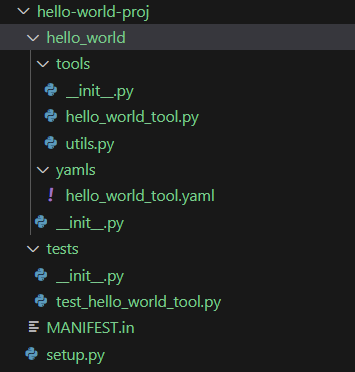

# Create your own tool package

### Prerequisites
Create a new conda environment using python 3.9 or 3.10. Run below command to install PromptFlow dependencies:
```
pip install promptflow-sdk --extra-index-url https://azuremlsdktestpypi.azureedge.net/promptflow/
```
Install Pytest packages for running tests:
```
pip install pytest
pip install pytest-mock
```

### Create custom tool package
Run below command under root folder to create your tool project quickly:
```
python scripts\generate_tool_package_template.py --destination <your-tool-project> --package-name <your-package-name> --tool-name <your-tool-name> --function-name <your-tool-function-name>
```
For example:
```
python scripts\generate_tool_package_template.py --destination hello-world-proj --package-name hello-world --tool-name hello_world_tool --function-name get_greeting_message
```
This auto-generated script will create one tool for you. The parameters _destination_ and _package-name_ are mandatory. The parameters _tool-name_ and _function-name_ are optional. If left unfilled, the _tool-name_ will default to _hello_world_tool_, and the _function-name_ will default to _tool-name_.

The command will generate the tool project as follows with one tool `hello_world_tool.py` in it:



```The points outlined below explain the purpose of each folder/file in the package. If your aim is to develop multiple tools within your package, please make sure to closely examine point 2 and 5.```

1. **hello-world-proj**: This is the source directory. All of your project's source code should be placed in this directory.
2. **hello-world/tools**: This directory contains the individual tools for your project. You tool package can contain either one tool or many tools. When adding a new tool, you should create another *_tool.py under the `tools` folder.
3. **hello-world/tools/hello_world_tool.py**: Develop your tool within the def function. Use the `@tool` decorator to identify the function as a tool.
    > [!Note] There are two ways to write a tool. The default and recommended way is the function implemented way. You can also use the class implementation way, referring to [my_tool_2.py](my_tool_package/tools/my_tool_2.py) as an example.
3. **hello-world/tools/utils.py**: This file implements the tool list method, which collects all the tools defined. It is required to have this tool list method, as it allows the User Interface (UI) to retrieve your tools and display them within the UI.
    > [!Note] There's no need to create your own list method if you maintain the existing folder structure. You can simply use the auto-generated list method provided in the `utils.py` file.
4. **hello_world/yamls/hello_world_tool.yaml**: Tool YAMLs defines the metadata of the tool. The tool list method, as outlined in the `utils.py`, fetches these tool YAMLs.

    You may want to update `name` and `description` to a better one in `your_tool.yaml`, so that tool can have a great name and description hint in prompt flow UI.
    > [!Note] If you create a new tool, don't forget to also create the corresponding tool YAML. you can use below command under your tool project to auto generate your tool YAML.
    ```
    python ..\scripts\package_tools_generator.py -m <tool_module> -o <tool_yaml_path>
    ```
    For example:
    ```
    python ..\scripts\package_tools_generator.py -m hello_world.tools.hello_world_tool -o hello_world\yamls\hello_world_tool.yaml
    ```
    To populate your tool module, adhere to the pattern \<package_name\>.tools.\<tool_name\>, which represents the folder path to your tool within the package.
5. **tests**: This directory contains all your tests, though they are not required for creating your custom tool package. When adding a new tool, you can also create corresponding tests and place them in this directory. Run below command under your tool project:
    ```
    pytest tests
    ```
6. **MANIFEST.in**: This file is used to determine which files to include in the distribution of the project. Tool YAML files should be included in MANIFEST.in so that your tool YAMLs would be packaged and your tools can show in the UI.
    > [!Note] There's no need to update this file if you maintain the existing folder structure.
7. **setup.py**: This file contains metadata about your project like the name, version, author, and more. Additionally, the entry point is automatically configured for you in the `generate_tool_package_template.py` script. In Python, configuring the entry point in `setup.py` helps establish the primary execution point for a package, streamlining its integration with other software. 

    The `package_tools` entry point together with the tool list method are used to retrieve all the tools and display them in the UI.
    ```python
    entry_points={
          "package_tools": ["<your_tool_name> = <list_module>:<list_method>"],
    },
    ```
    > [!Note] There's no need to update this file if you maintain the existing folder structure.

### Build and share the tool package
  Execute the following command in the tool package root directory to build your tool package:
  ```
  python setup.py sdist bdist_wheel
  ```
  This will generate a tool package `<your-package>-0.0.1.tar.gz` and corresponding `whl file` inside the `dist` folder.

  Create an account on PyPI if you don't already have one, and install `twine` package by running `pip install twine`.

  Upload your package to PyPI by running `twine upload dist/*`, this will prompt you for your Pypi username and password, and then upload your package on PyPI. Once your package is uploaded to PyPI, others can install it using pip by running `pip install your-package-name`. Make sure to replace `your-package-name` with the name of your package as it appears on PyPI.

  If you only want to put it on Test PyPI, upload your package by running `twine upload --repository-url https://test.pypi.org/legacy/ dist/*`. Once your package is uploaded to Test PyPI, others can install it using pip by running `pip install --index-url https://test.pypi.org/simple/ your-package-name`.
