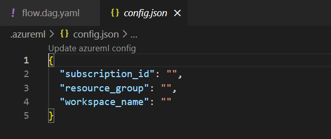

# Consume connections from Azure AI

For a smooth development flow that transitions from cloud (Azure AI) to local environments, you can directly utilize the connection already established on the cloud by setting the connection provider to "Azure AI connections".

:::{note}
Promptflow is not able to manage connections from Azure AI, please manage it in workspace portal, [Azure AI Studio](https://learn.microsoft.com/en-us/azure/ai-studio/how-to/connections-add), az ml cli or azure-ai-ml sdk.
:::

You can set the connection provider using the following steps:

1. Navigate to the connection list in the VS Code primary sidebar.

1. Click on the ... (more options icon) at the top and select the `Set connection provider` option.

    

1. Choose one of the "Azure AI connections" provider types that you wish to use. [Click to learn more about the differences between the connection providers](#different-connection-providers).

    

    1. If you choose "Azure AI Connections - for current working directory", then you need to specify the cloud resources in the `config.json` file within the project folder.

        
    
    1. If you choose "Azure AI Connections - for this machine", specify the cloud resources in the connection string. You can do this in one of two ways:
    
        (1) Input connection string in the input box above.
    For example `azureml://subscriptions/<your-subscription>/resourceGroups/<your-resourcegroup>/providers/Microsoft.MachineLearningServices/workspaces/<your-workspace>`

        

         (2) Follow the wizard to set up your config step by step.
    
        
  1. Once the connection provider is set, the connection list will automatically refresh, displaying the connections retrieved from the selected provider.

Note:
1. You need to have a project folder open to use the "Azure AI connections - for current working directory" option.
1. Once you change the connection provider, it will stay that way until you change it again and save the new setting.

## Different connection providers

Currently, we support three types of connections:

|Connection provider|Type|Description|Provider Specification|Use Case|
|---|---|---|---|---|
| Local Connections| Local| Enables consume the connections created and locally and stored in local sqlite. |NA| Ideal when connections need to be stored and managed locally.|
|Azure AI connection - For current working directory| Cloud provider| Enables the consumption of connections from a cloud provider, such as a specific Azure Machine Learning workspace or Azure AI project.| Specify the resource ID in a `config.json` file placed in the project folder.   [Click here for more details](../../how-to-guides/set-global-configs.md#azureml)| A dynamic approach for consuming connections from different providers in specific projects. Allows for setting different provider configurations for different flows by updating the `config.json` in the project folder.|
|Azure AI connection - For this machine| Cloud| Enables the consumption of connections from a cloud provider, such as a specific Azure Machine Learning workspace or Azure AI project. | Use a `connection string` to specify a cloud resource as the provider on your local machine.   [Click here for more details](../../how-to-guides/set-global-configs.md#full-azure-machine-learning-workspace-resource-id)|A global provider setting that applies across all working directories on your machine.|

## Next steps

- Set global configs on [connection.provider](../../how-to-guides/set-global-configs.md#connectionprovider).
- [Manage connections on local](../../how-to-guides/manage-connections.md).
