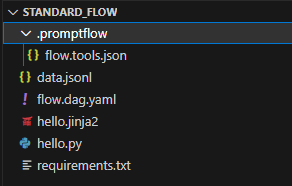

# Initialize and test a flow

:::{admonition} Experimental feature
This is an experimental feature, and may change at any time. Learn [more](https://aka.ms/azuremlexperimental).
:::

From this document, customer can initialize a flow and test it locally.

## Initialize flow

Creating a flow folder with code/prompts and yaml definitions of the flow.

### Initialize flow from scratch

Promptflow can [create three types of flow folder](https://promptflow.azurewebsites.net/concepts/concept-flows.html#flow-types):
- standard: Basic structure of flow folder.
- chat: Chat flow is designed for conversational application development, building upon the capabilities of standard flow and providing enhanced support for chat inputs/outputs and chat history management.
- evaluation: Evaluation flows are special types of flows that assess how well the outputs of a flow align with specific criteria and goals.

::::{tab-set}
:::{tab-item} CLI
:sync: CLI

```bash
# Create a flow
pf flow init --flow <flow-name>

# Create a chat flow
pf flow init --flow <flow-name> --type chat
```
:::

:::{tab-item} VS Code Extension
:sync: VS Code Extension

TODO add screenshot

:::

::::


Structure of flow folder:
- **flow.dag.yaml**: The flow definition with inputs/outputs, nodes, tools and variants for authoring purpose.
- **.promptflow/flow.tools.json**: It contains all package tools meta that references in `flow.dag.yaml`.
- **Source code files (.py, .jinja2)**: User managed, the code scripts that references by tools.
- **requirements.txt**: Python package dependencies for this flow.




### Create from existing code

Promptflow CLI can generate the yaml definitions needed for prompt flow from the existing folder, using the tools script and prompt templates.

```bash
# Create a flow in existing folder
pf flow init --flow <flow-name> --entry <entry-file-name> --function <tool-function-name> --prompt-template <prompt-tempate>
```

For example, using promptflow CLI initialize [intent-copilot](https://github.com/microsoft/promptflow/tree/main/examples/flows/standard/intent-copilot)


In this case, promptflow CLI generates `flow.dag.json`, `.promptflow/tools.json`  and `extract_intent_tool.py`, it is a python tool in the flow.


## Test a flow locally

Promptflow also provides ways to test the initialized flow or flow node locally. It will help you quickly test your flow.


### Test flow

Customer can use CLI or VS Code extension to test the flow locally.

::::{tab-set}
:::{tab-item} CLI
:sync: CLI

```bash
# Test flow in local
pf flow test --flow <flow-name>

# Test flow with specified variant
pf flow test --flow <flow-name> --variant ${<node-name>.<variant-name>}
```

The log and result of flow test will be displayed in the terminal.


Promptflow CLI will generate test logs and outputs in `.promptflow`:
- **flow.detail.json**: Defails info of flow test, include the result of each node.
- **flow.log**: The log of flow test.
- **flow.output.json**: The result of flow test.


:::

:::{tab-item} SDK
:sync: SDK

The return value of `test` function is the flow outputs.

```python
from promptflow import PFClient

pf_client = PFClient()

# Test flow
inputs = {"<flow_input_name>": "<flow_input_value>"}  # The inputs of the flow.
flow_result = pf_client.test(flow="<flow_folder_path>", inputs=inputs)
print(f"Flow outputs: {flow_result}")
```

The log and result of flow test will be displayed in the terminal.


Promptflow CLI will generate test logs and outputs in `.promptflow`:
- **flow.detail.json**: Defails info of flow test, include the result of each node.
- **flow.log**: The log of flow test.
- **flow.output.json**: The result of flow test.


:::

:::{tab-item} VS Code Extension
:sync: VS Code Extension

TODO add screenshot

:::

::::


### Test a single node in the flow

Customer can test a single python node in the flow locally. It will use customer provides date or the default value of the node as input. It will only use customer specified node to execute with the input.

::::{tab-set}
:::{tab-item} CLI
:sync: CLI

Customer can execute this command to test the flow.

```bash
# Test flow node in local
pf flow test --flow <flow-name> --node <node-name>
```

The log and result of flow node test will be displayed in the terminal. And the details of node test will generated to `.promptflow/flow-<node-name>.node.detail.json`.

:::

:::{tab-item} SDK
:sync: SDK

Customer can execute this command to test the flow. The return value of `test` function is the node outputs.

```python
from promptflow import PFClient

pf_client = PFClient()

# Test not iun the flow
inputs = {<node_input_name>: <node_input_value>}  # The inputs of the node.
node_result = pf_client.test(flow=<flow_folder_path>, inputs=inputs, node=<node_name>)
print(f"Node outputs: {node_result}")
```

The log and result of flow node test will be displayed in the terminal. And the details of node test will generated to `.promptflow/flow-<node-name>.node.detail.json`.

:::

:::{tab-item} VS Code Extension
:sync: VS Code Extension

TODO add screenshot

:::

::::

### Test with interactive mode


::::{tab-set}
:::{tab-item} CLI
:sync: CLI

Promptflow CLI provides a way to start an interactive chat session for chat flow. Customer can use below command to start an interactive chat session:

```bash
# Chat in the flow
pf flow test --flow <flow-name> --interactive
```

After executing this command, customer can interact with the chat flow in the terminal. Customer can press **Enter** to send the message to chat flow. And customer can quit with **ctrl+Z**.
Promptflow CLI will distinguish the output of different roles by color, <span style="color:Green">User input</span>, <span style="color:Gold">Bot output</span>, <span style="color:Blue">Flow script output</span>, <span style="color:Cyan">Node output</span>.

Using this [chat flow](https://github.com/microsoft/promptflow/tree/main/examples/flows/chat/basic-chat) to show how to use interactive mode.


:::

:::{tab-item} VS Code Extension
:sync: VS Code Extension

TODO add screenshot

:::

::::

### Debug a single node in the flow

Customer can debug a single python node in VScode by the extension.

::::{tab-set}
:::{tab-item} VS Code Extension
:sync: VS Code Extension
TODO add screenshot

:::

::::


## Next steps

- Flow bulk test