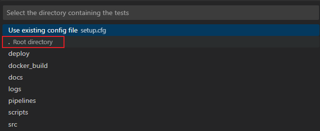
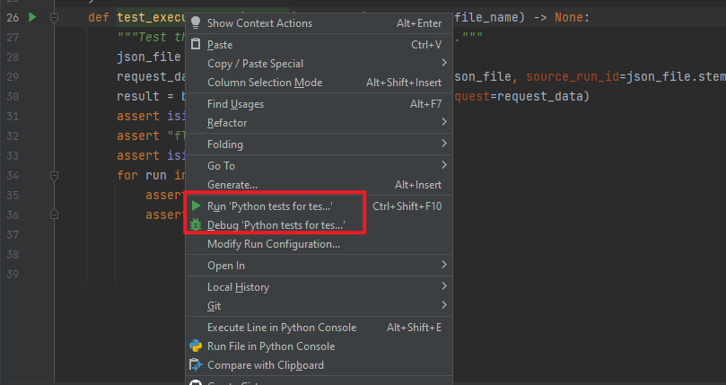

# Dev Setup

## Set up process

- First create a new [conda](https://conda.io/projects/conda/en/latest/user-guide/getting-started.html) environment. Please specify python version as 3.9.
  `conda create -n <env_name> python=3.9`.
- Activate the env you created.
- In root folder, run `python scripts/dev-setup/main.py` to install the packages and dependencies.

## How to run tests

### Set up your secrets

`dev-connections.json.example` is a template about connections provided in `src/promptflow`. You can follow these steps to refer to this template to configure your connection for the test cases:
1. `cd ./src/promptflow`
2. Run the command `cp dev-connections.json.example connections.json`;
3. Replace the values in the json file with your connection info;
4. Set the environment `PROMPTFLOW_CONNECTIONS='connections.json'`;

After above setup process is finished. You can use `pytest` command to run test, for example in root folder you can:

### Run tests via command

- Run all tests under a folder: `pytest src/promptflow/tests -v`
- Run a single test: ` pytest src/promptflow/tests/promptflow_test/e2etests/test_executor.py::TestExecutor::test_executor_basic_flow -v`

### Run tests in VSCode

1. Set up your python interperter

- Open the Command Palette (Ctrl+Shift+P) and select `Python: Select Interpreter`.

- Select existing conda env which you created previously.

2. Set up your test framework and directory

- Open the Command Palette (Ctrl+Shift+P) and select `Python: Configure Tests`.

- Select `pytest` as test framework.

- Select `Root directory` as test directory.

3. Exclude specific test folders.

You can exclude specific test folders if you don't have some extra dependency to avoid VS Code's test discovery fail.
For example, if you don't have azure dependency, you can exclude `sdk_cli_azure_test`.
Open `.vscode/settings.json`, write `"--ignore=src/promptflow/tests/sdk_cli_azure_test"` to `"python.testing.pytestArgs"`.

4. Click the `Run Test` button on the left

### Run tests in pycharm

1. Set up your pycharm python interpreter

2. Select existing conda env which you created previously

3. Run test, right-click the test name to run, or click the green arrow button on the left.

### Record and replay tests

Please refer to [Replay End-to-End Tests](./replay-e2e-test.md) to learn how to record and replay tests.

## How to write docstring.

A clear and consistent API documentation is crucial for the usability and maintainability of our codebase. Please refer to [API Documentation Guidelines](./documentation_guidelines.md) to learn how to write docstring when developing the project.

## How to write tests

- Put all test data/configs under `src/promptflow/tests/test_configs`.
- Write unit tests:
  - Flow run: `src/promptflow/tests/sdk_cli_test/unittest/`
  - Flow run in azure: `src/promptflow/tests/sdk_cli_azure_test/unittest/`
- Write e2e tests:
  - Flow run: `src/promptflow/tests/sdk_cli_test/e2etests/`
  - Flow run in azure: `src/promptflow/tests/sdk_cli_azure_test/e2etests/`
- Test file name and the test case name all start with `test_`.
- A basic test example, see [test_connection.py](../../src/promptflow/tests/sdk_cli_test/e2etests/test_connection.py).

### Test structure

Currently all tests are under `src/promptflow/tests/` folder:

- tests/
  - promptflow/
    - sdk_cli_test/
      - e2etests/
      - unittests/
    - sdk_cli_azure_test/
      - e2etests/
      - unittests/
  - test_configs/
    - connections/
    - datas/
    - flows/
    - runs/
    - wrong_flows/
    - wrong_tools/

When you want to add tests for a new feature, you can add new test file let's say a e2e test file `test_construction.py`
under `tests/promptflow/**/e2etests/`.

Once the project gets more complicated or anytime you find it necessary to add new test folder and test configs for
a specific feature, feel free to split the `promptflow` to more folders, for example:

- tests/
  - (Test folder name)/
    - e2etests/
      - test_xxx.py
    - unittests/
      - test_xxx.py
  - test_configs/
    - (Data or config folder name)/
