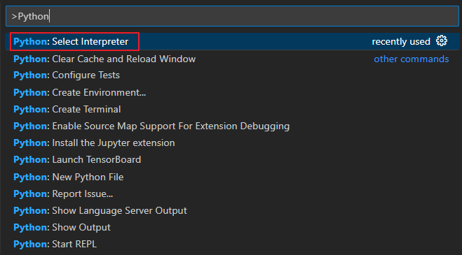
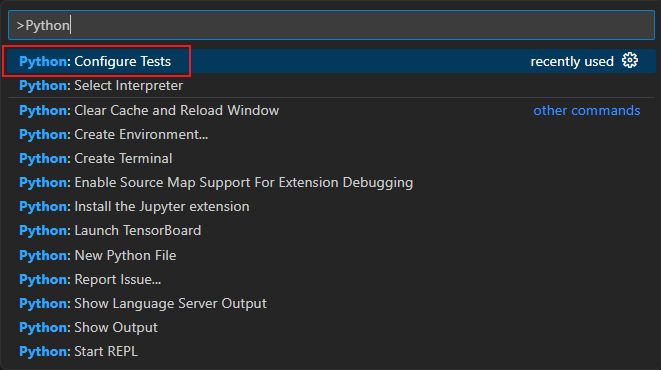
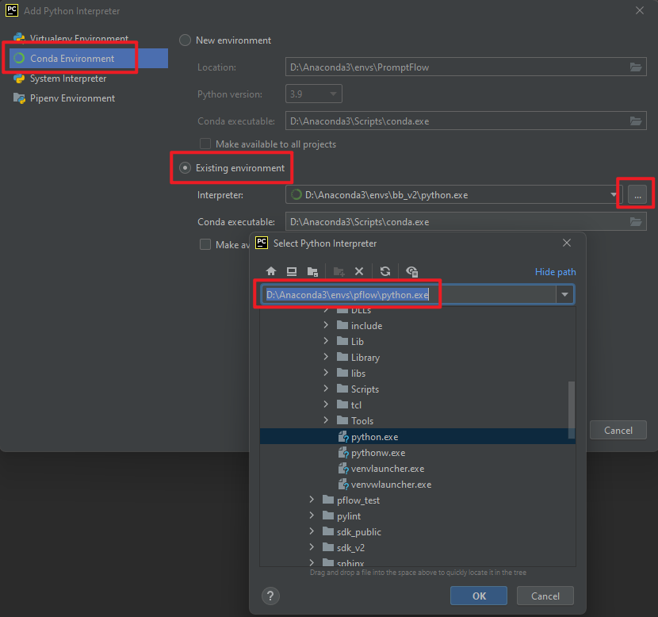

# PromptFlow SDK

## Set up process

- First create a new [conda](https://conda.io/projects/conda/en/latest/user-guide/getting-started.html) environment. Please specify python version as 3.8.
  `conda create -n <envname> python=3.8`.
- Activate the env you created.
- Set environment variable `PYTHONPATH` in your new conda environment.
  `conda env config vars set PYTHONPATH=<path-to-src\promptflow>`.
  Once you have set the environment variable, you have to reactivate your environment.
  `conda activate <envname>`.
- Run `pip install -e <path-to-src\promptflow>` to install the package and dependencies.

## How to run tests

### Set up your secrets

Steps:

1. `cd ./src/promptflow`
2. Run the command `cp dev-connections.json.example connections.json`;
3. Replace the values in the json file with your connection info;
4. Set the environment `PROMPTFLOW_CONNECTIONS='connections.json'`;

After above setup process is finished. You can use `pytest` command to run test, for example in root folder you can:

### Run tests via command

- Run all tests under a folder: `pytest src/promptflow/tests -v`
- Run a single test: ` pytest src/promptflow/tests/promptflow_test/e2etests/test_executor.py::TestExecutor::test_executor_basic_flow -v`

### Run tests in VSCode

1. Set up your python interperter

- Open the Command Palette (Ctrl+Shift+P) and select `Python: Select Interpreter`.

- Select existing conda env which you created previously.

2. Set up your test framework and directory

- Open the Command Palette (Ctrl+Shift+P) and select `Python: Configure Tests`.

- Select `pytest` as test framework.

- Select `Root directory` as test directory.

3. Click the `Run Test` button on the left

### Run tests in pycharm

1. Set up your pycharm python interpreter

2. Select existing conda env which you created previously

3. Run test, right-click the test name to run, or click the green arrow button on the left.

## How to write tests

- Put all test data/configs under `src/promptflow/tests/test_configs`.
- Write unit tests:
  - Flow run in local: `src/promptflow/tests/sdk_cli_test/unittest/`
  - Flow run in azure: `src/promptflow/tests/sdk_cli_azure_test/unittest/`
- Write e2e tests:
  - Flow run in local: `src/promptflow/tests/sdk_cli_test/e2etests/`
  - Flow run in azure: `src/promptflow/tests/sdk_cli_azure_test/e2etests/`
- Test file name and the test case name all start with `test_`.
- A basic test example, see [test_connection.py](../src/promptflow/tests/sdk_cli_test/e2etests/test_connection.py).

### Test structure

Currently all tests are under `src/promptflow/tests/` folder:

- tests/
  - promptflow/
    - sdk_cli_test/
      - e2etests/
      - unittests/
    - sdk_cli_azure_test/
      - e2etests/
      - unittests/
  - test_configs/
    - connections/
    - datas/
    - flows/
    - runs/
    - wrong_flows/
    - wrong_tools/

When you want to add tests for a new feature, you can add new test file let's say a e2e test file `test_construction.py`
under `tests/promptflow/**/e2etests/`.

Once the project gets more complicated or anytime you find it necessary to add new test folder and test configs for
a specific feature, feel free to split the `promptflow` to more folders, for example:

- tests/
  - executor_test/
    - e2etests/
      - test_executor.py
    - unittests/
      - test_xxx.py
  - graph_construction_test/
    - e2etests/
      - test_construction.py
    - unittest/
  - test_configs/
    - executor_requests/
    - graph_construction_requests/

### Endpoint tests

Above tests are local dev tests although they might call other services when executing the nodes. There are also tests
that simulate the real user call which will submit a request to an endpoint.

For more details please refer to [Endpoint test](../scripts/deploy/README.md#endpoint-test).

## How to debug PromptFlow Runtime in VSCode

- Ctrl + ` to open terminal and enter your virtual env that install the package and dependencies. Terminal will show your virtual env.

- Open Run & debug tab. Click create a launch.json file. Then select flask. If you already has a .vscode folder, please remove it first.

- In launch.json, change FLASK_APP to relative path "src/promptflow-sdk/promptflow/runtime/app.py", and add args "--port", "8080"

- Press F5 to run. Now you can debug promptflow runtime and add break point

## How to debug Enterprise edition locally

To start enterprise version app locally for testing and debugging, you would need to:

* Setp1: Modify the [runtime_config.py](https://msdata.visualstudio.com/Vienna/_git/PromptFlow?path=/src/promptflow-sdk/promptflow/runtime/runtime_config.py&version=GBmain&line=621&lineEnd=621&lineStartColumn=48&lineEndColumn=56&lineStyle=plain&_a=contents) file, replace the `dev.yaml` with `enterprise-on-local.yaml`.

  
* Step2: Add the `config.json` file of the Workspace you want to test on to `src/promptflow-sdk/promptflow/runtime/config `directory.

  

  You can download the `config.json` from portal.

  
* Step3: Run or debug the enterprise version locally.

  

  Sample request:

  `prt execute --file ../../src/promptflow-sdk/tests/test_configs/executor_api_requests/bulk_test_requests/qa_with_bing_bulk_test_without_variant.json --url http://127.0.0.1:8080/ --connection_config connections.json`
