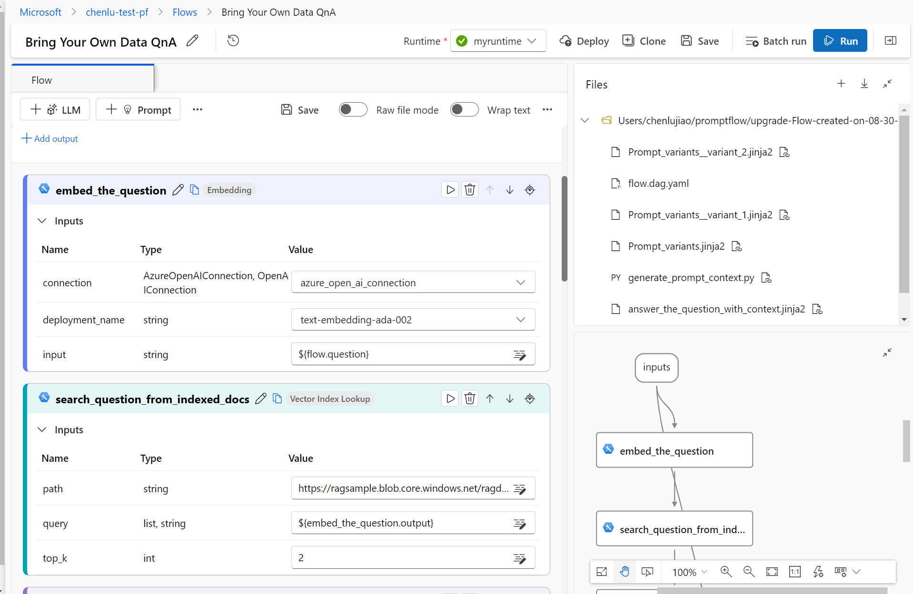
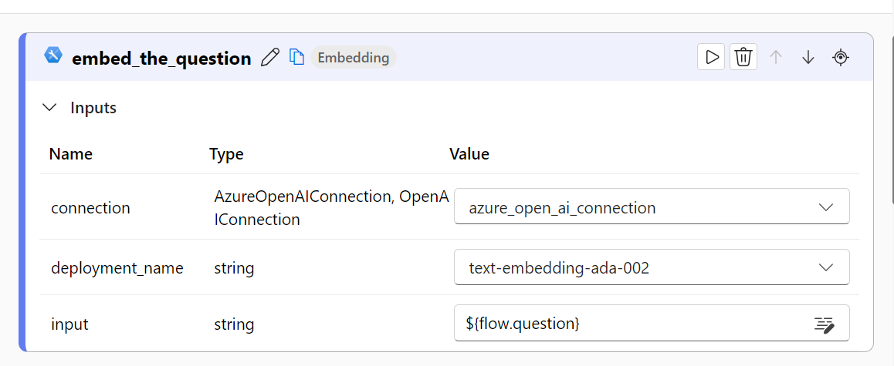
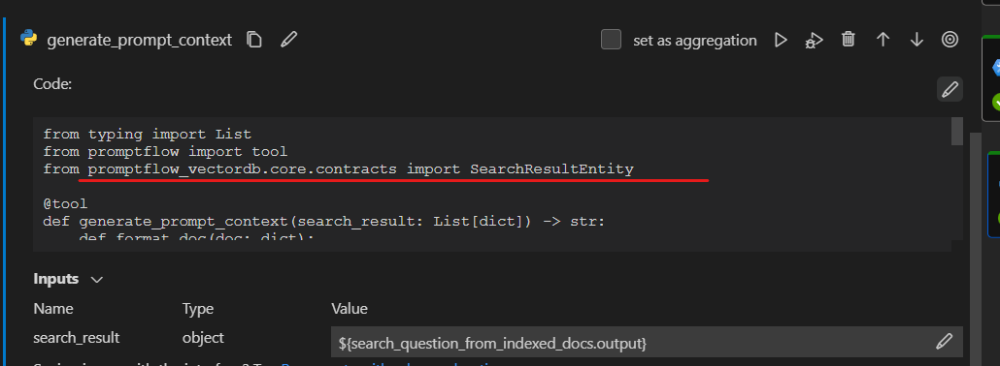

# From cloud to local - Bring Your Own Data QnA

## Prerequisites

1. Install promptflow SDK:
   ``` bash
      pip install promptflow promptflow-tool
   ```

   More detail you can refer to [promptflow local qucik start](https://github.com/Azure/promptflow/blob/main/docs/community/local/quick-start.md)

2. Install promptflow-vectordb SDK:
   ``` bash
      pip install promptflow-vectordb
   ```

3. (Optional) Install promptflow extension in VS Code
   
   
   
## Download your flow files to local

For example, there is already a flow "Bring Your Own Data Qna" in the workspace, which use the **Vector index lookup** tool to search question from the indexed docs.

The index docs is stroed in the workspace binding storage blog.

   

Go to the flow authoring, click **Download** icon in the file explorer. It will download the flow zip package to local, such as "Bring Your Own Data Qna.zip" file which contains the flow files.

   

## Open the flow folder in VS Code

Unzip the "Bring Your Own Data Qna.zip" locally, and open the "Bring Your Own Data Qna" folder in VS Code desktop.

> [!TIP]
> If you don't depend on the prompt flow extension in VS Code, you can open the folder in any IDE you like.

## Create a local connection

To use the vector index lookup tool locally, you need to create the same connection to the vector index service as you did in the cloud.

  

Open the "flow.dag.yaml" file, search the "connections" section, you can find the connextion configuration you used in your Azure Machine Learning workspace.

  
Create a local connection same as the cloud one.

::::{tab-set}

:::{tab-item} CLI :sync: CLI

Create a connection yaml file "AzureOpenAIConnection.yaml", then run the connection create CLI command in the terminal:
``` yaml
   $schema: https://azuremlschemas.azureedge.net/promptflow/latest/AzureOpenAIConnection.schema.json
   name: azure_open_ai_connection
   type: azure_open_ai  
   api_key: "<aoai-api-key>" #your key
   api_base: "aoai-api-endpoint"
   api_type: "azure"
   api_version: "2023-03-15-preview"
```

``` bash
   pf connection create -f AzureOpenAIConnection.yaml
```
:::

:::{tab-item} VS Code Extension :sync: VS Code Extension

If you have the **promptflow extension** installed in VS Code desktop, you can create the connection in the extension UI.

Click the promptflow extension icon to go to the promptflow management central place. Click the **+** icon in the connection explorer, and select the connection type "AzureOpenAI"


:::

::::


## Check and modify the flow files

::::{tab-set}

:::{tab-item} VS Code Extension :sync: VS Code Extension

1. Open "flow.dag.yaml" and click "Visual editor"

   

   > [!NOTE]
   > When legacy tools switching to code first mode, "not found" error may occur, please refer to [Vector DB/Faiss Index/Vector Index Lookup tool](Tool_Reminder.md) rename reminder


2. Jump to the "embed_the_question" node, make sure the connection is the local connection you have created, and double check the deployment_name which is the model you use here for the embedding.

   
 
3. Jump to the "search_question_from_indexed_docs" node, which consume the Vector Index Lookup Tool in this flow. Check the path of your indexed docs you specify. All public accessible path is supported, such as: `https://github.com/Azure/azureml-assets/tree/main/assets/promptflow/data/faiss-index-lookup/faiss_index_sample`.

   > [!NOTE]
   > If your indexed docs is stored in the workspace bind Azure blob storage (the path in your workspace is as the screenshot below), the local consume of it need Azure authentication.
   >
   > Before run the flow, make sure you have `az login` and connect to the Azure machine learning workspace.
   >
   > More detail you can refer to [Connect to Azure machine learning workspace](integrate_with_llmapp-devops.md#connect-to-azure-machine-learning-workspace)

   

   Then click on the "Edit" button located within the "query" input box. This will take you to the raw flow.dag.yaml file and locate to the definition of this node.

   

   Check the "tool" section within this node. Ensure that the value of the "tool" section is set to `promptflow_vectordb.tool.vector_index_lookup.VectorIndexLookup.search`. This tool package name of the VectorIndexLookup local version.

4. Jump to the "generate_prompt_context" node, check the package name of the vector tool in this python node is `promptflow_vectordb`.

   

5. Jump to the "answer_the_question_with_context" node, check the connection and deployment_name as well.

   

## Test and run the flow

Scroll up to the top of the flow, fill in the "Inputs" value of this single run for testing, for example "How to use SDK V2?", then run the flows. Then click the "Run" button in the top right corner. This will trigger a single run of the flow.

   

For batch run and evaluation, you can refer to [Submit flow run to Azure machine learning workspace](integrate_with_llmapp-devops.md#submit-flow-run-to-azure-machine-learning-workspace)

:::

::::