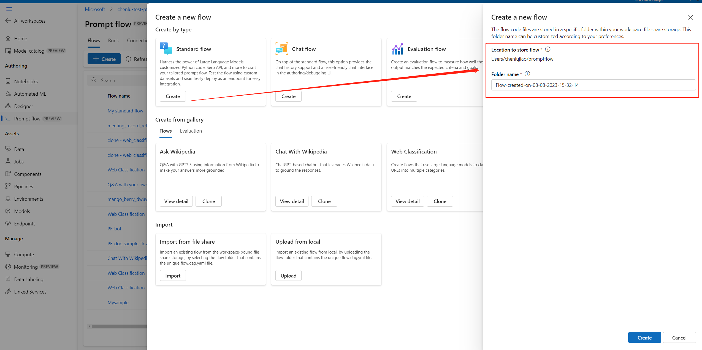
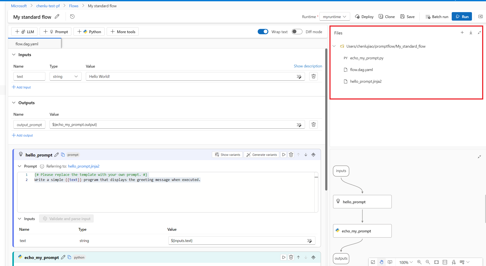
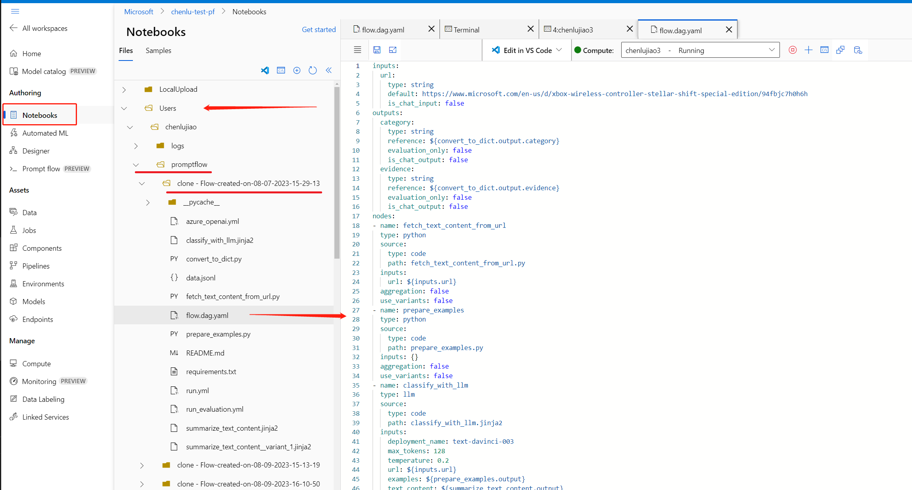
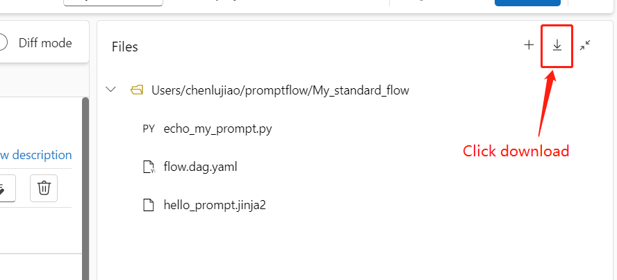
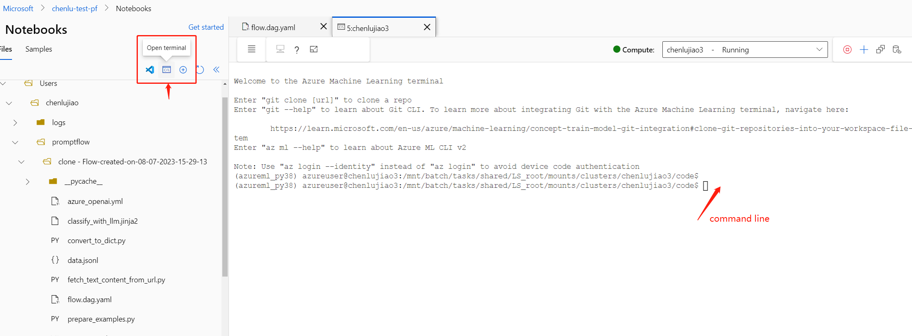
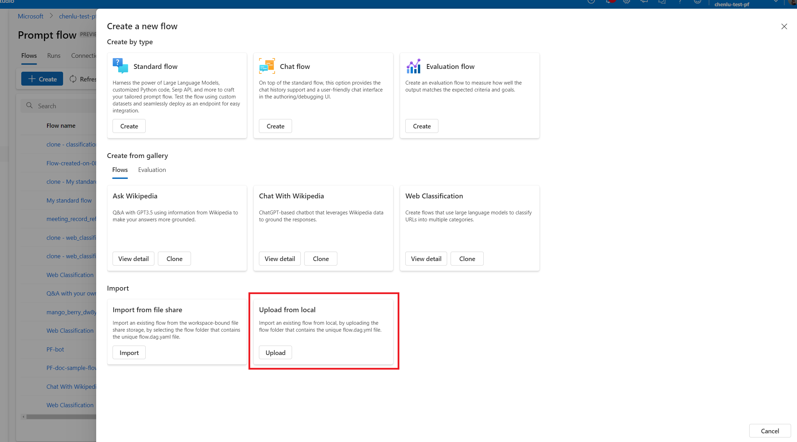

# Integrate Prompt Flow with LLMOps (preview)

In this article, you'll learn about the integration of prompt flow with LLMOps (Large Language Model Operationalization) in Azure Machine Learning. Prompt flow offers a developer-friendly experience for flow developing and iterating with LLMOps. 

It provides an **prompt flow SDK and CLI** to facilitate the development of flows, triggering of flow runs, evaluation runs, and transitioning flows from local to cloud (Azure Machine Learning workspace) environments. 

This documentation focuses on how to effectively combine the capabilities of prompt flow code experience and LLMOps to enhance your LLM-based application development workflows.

We introduce the following sections:
* [Introduction of code-first experience in Prompt Flow](#introduction-of-code-first-experience-in-prompt-flow)
* [Accessing prompt flow code definition](#accessing-prompt-flow-code-definition)
* [Versioning prompt flow code in repository](#versioning-prompt-flow-code-in-repository)
* [Submitting runs to cloud](#submitting-runs-to-cloud)
* [Iterative development](#iterative-development)
* [CICD integration](#cicd-integration)


## Introduction of code-first experience in Prompt Flow

When developing applications using LLM, it is common to have a standardized application engineering process that includes code repositories and CI/CD pipelines. This integration allows for a streamlined development process, version control, and collaboration among team members.

For developers experienced in code development who seek a more efficient LLMOps iteration process, the following key features and benefits you can gain from prompt flow code experience:

* **Flow versioning in code repository**. You can define your flow in YAML format, which can stay aligned with the referenced source files in a folder structure.

* **Integrate flow run with CI/CD pipeline**. You can trigger flow runs using the prompt flow CLI or SDK, which can be seamlessly integrated into your CI/CD pipeline and delivery process.

* **Smooth transition from local to cloud**. You can easily export your flow folder to your local or code repository for version control, local development and sharing. Similarly, the flow folder can be effortlessly imported back to the cloud for further authoring, testing, deployment in cloud resources.

## Accessing prompt flow code definition

Each flow each prompt flow is associated with a **flow folder structure** that contains essential files for defining the flow in code **folder structure**. This folder structure organizes your flow, facilitating smoother transitions.

Azure Machine Learning offers a shared file system for all workspace users. Upon creating a flow, a corresponding flow folder is automatically generated and stored there, located in the ```Users/<username>/promptflow``` directory.



### Flow folder structure

Overview of the flow folder structure and the key files it contains:

- **flow.dag.yaml**: This primary flow definition file, in YAML format, includes information about inputs, outputs, nodes, tools, and variants used in the flow. It is integral for authoring and defining the prompt flow.
- **Source code files (.py, .jinja2)**: The flow folder also includes user-managed source code files, which are referred to by the tools/nodes in the flow.
    - Files in Python (.py) format can be referenced by the python tool for defining custom python logic.
    - Files in Jinja2 (.jinja2) format can be referenced by the prompt tool or LLM tool for defining prompt context.
- **Non-source files**: The flow folder may also contain non-source files such as utility files and data files that can be included in the source files.

Once the flow is created, you can navigate to the Flow Authoring Page to view and operate the flow files in the right file explorer. This allows you to view, edit, and manage your files. Any modifications made to the files will be directly reflected in the file share storage.



Alternatively, you can access all the flow folders directly within the Azure Machine Learning notebook.



## Versioning prompt flow code in repository

To check in your flow into your code  repository, you can easily export the flow folder from the flow authoring page to your local system. This will download a package containing all the files from the explorer to your local machine, which you can then check into your code repository.



Additionally, you can access your workspace file system through the Azure Machine Learning notebook. Within the notebook, you can [access the compute instance terminal](https://learn.microsoft.com/en-us/azure/machine-learning/how-to-access-terminal?view=azureml-api-2) and navigate to the ```Users/<username>/promptflow``` directory, where your flows are stored.



In the terminal, you can utilize the ```git``` command to initialize a git repository, clone your existing git repository, and push the flow folder to your code repository.

For more details, you can refer to [Git integration in Azure machine learning](https://learn.microsoft.com/en-us/azure/machine-learning/concept-train-model-git-integration?view=azureml-api-2&tabs=python).

## Submitting runs to the cloud from local repository

### Prerequisites

- Complete the [Create resources to get started](https://learn.microsoft.com/en-us/azure/machine-learning/quickstart-create-resources) if you don't already have an Azure Machine Learning workspace.

- A Python environment in which you've installed Azure Machine Learning Python SDK v2 - [install instructions](https://github.com/Azure/azureml-examples/tree/sdk-preview/sdk#getting-started) - check the getting started section. This environment is for defining and controlling your Azure Machine Learning resources and is separate from the environment used at runtime for training.

### Install prompt flow SDK

```shell
pip install -r ../../exmples/requirements.txt
```

### Connect to Azure machine learning workspace

::::{tab-set}

:::{tab-item} CLI
:sync: CLI

```sh
az login
```

:::

:::{tab-item} SDK
:sync: SDK

```python
import json

# Import required libraries
from azure.identity import DefaultAzureCredential, InteractiveBrowserCredential
from azure.ai.ml import MLClient

# azure version promptflow apis
from promptflow.azure import PFClient

# Configure credential
try:
    credential = DefaultAzureCredential()
    # Check if given credential can get token successfully.
    credential.get_token("https://management.azure.com/.default")
except Exception as ex:
    # Fall back to InteractiveBrowserCredential in case DefaultAzureCredential not work
    credential = InteractiveBrowserCredential()

# Get a handle to workspace
ml_client = MLClient.from_config(credential=credential)

pf = PFClient(ml_client)
```

:::

::::


### Submit flow run to Azure machine learning workspace

We will use [web-classification flow](../../examples/flows/standard/web-classification/) as example.

::::{tab-set}

:::{tab-item} CLI
:sync: CLI

Prepare the `run.yml` to define the config for this flow run in cloud.

```yaml
$schema: https://azuremlschemas.azureedge.net/promptflow/latest/Run.schema.json
flow: <path_to_flow>
data: <path_to_flow>/data.jsonl

# define cloud resource
runtime: <runtime_name>
connections:
  classify_with_llm:
    connection: <connection_name>
    deployment_name: <deployment_name>
  summarize_text_content:
    connection: <connection_name>
    deployment_name: <deployment_name>
```

```sh
pfazure run create --file run.yml
```

:::

:::{tab-item} SDK
:sync: SDK

```python
# load flow
flow = "<path_to_flow>"
data = "<path_to_flow>/data.jsonl"

# define cloud resource
runtime = <runtime_name>
connections = {"classify_with_llm":
                  {"connection": <connection_name>,
                  "deployment_name": <deployment_name>},
               "summarize_text_content":
                  {"connection": <connection_name>,
                  "deployment_name": <deployment_name>}
                }
# create run
base_run = pf.run(
    flow=flow,
    data=data,
    runtime=runtime,  
    connections=connections,  
)
print(base_run)
```

:::

::::

### Evaluation your flow to Azure machine learning workspace

- We will use [classification-accuracy-eval flow](../../examples/flows/evaluation/classification-accuracy-eval/) as example.

::::{tab-set}

:::{tab-item} CLI
:sync: CLI

Prepare the `run_evaluation.yml` to define the config for this evaluation flow run in cloud.

```yaml
$schema: https://azuremlschemas.azureedge.net/promptflow/latest/Run.schema.json
flow: <path_to_flow>
data: <path_to_flow>/data.jsonl
run: <id of web-classification flow run>
column_mapping:
  groundtruth: ${data.answer}
  prediction: ${run.outputs.category}

# define cloud resource
runtime: <runtime_name>
connections:
  classify_with_llm:
    connection: <connection_name>
    deployment_name: <deployment_name>
  summarize_text_content:
    connection: <connection_name>
    deployment_name: <deployment_name>

```

```sh
pfazure run create --file run_evaluation.yml
```

:::

:::{tab-item} SDK
:sync: SDK

```python
# load flow
flow = "<path_to_flow>"
data = "<path_to_flow>/data.jsonl"

# define cloud resource
runtime = <runtime_name>
connections = {"classify_with_llm":
                  {"connection": <connection_name>,
                  "deployment_name": <deployment_name>},
               "summarize_text_content":
                  {"connection": <connection_name>,
                  "deployment_name": <deployment_name>}
                }

# create evaluation run
eval_run = pf.run(
    flow=flow
    data=data,
    run=base_run,
    column_mapping={
        "groundtruth": "${data.answer}",
        "prediction": "${run.outputs.category}",
    },
    runtime=runtime,
    connections=connections
)
```

:::

::::


### View run results in Azure machine learning workspace

Submit flow run to cloud will return the portal url of the run. You can open the uri view the run results in the portal.

You can also use following command to view results for runs.

#### Steam the logs

::::{tab-set}

:::{tab-item} CLI
:sync: CLI

```sh
pfazure run stream --name <run_name>
```

:::

:::{tab-item} SDK
:sync: SDK

```python
pf.stream("<run_name>")
```

:::

::::

#### View run outputs

::::{tab-set}

:::{tab-item} CLI
:sync: CLI

```sh
pfazure run show-details --name <run_name>
```

:::

:::{tab-item} SDK
:sync: SDK

```python
details = pf.get_details(eval_run)
details.head(10)
```

:::

::::


#### View metrics of evaluation run


::::{tab-set}

:::{tab-item} CLI
:sync: CLI

```sh
pfazure run show-metrics --name <evaluation_run_name>
```

:::

:::{tab-item} SDK
:sync: SDK

```python
pf.get_metrics("evaluation_run_name")
```

:::

::::

## Iterative development

### Local Iterations

When developing and refining your flow, you might want to perform multiple iterations locally within your code repository. We provide community version, that are **Prompt flow vs code extension** and **Prompt flow local SDK & CLI**, to support pure local development and testing, without Azure binding.

#### Prompt flow vs code extension

With the Prompt Flow VS Code extension installed, you can easily author your flow locally from the VS Code editor, providing a similar UI experience as in the cloud.

To use the extension:
1. Open a prompt flow folder in VS Code Desktop.
2. Open the ```flow.dag.yaml`` file in notebook view.
3. Use the visual editor to make any necessary changes to your flow, such as tune the prompts in variants, or add more tools.
4. To test your flow, click the "Run Flow" button at the top of the visual editor. This will trigger a flow test.


#### Prompt flow local SDK & CLI

If you prefer to use Jupyter, PyCharm, Visual Studio, or other IDEs, you can directly modify the YAML definition in the ```flow.dag.yaml``` file.


You can then trigger a flow single run for testing using either the Prompt Flow CLI or SDK.

::::{tab-set}

:::{tab-item} CLI
:sync: CLI

Assuming you are in working directory `<path-to-the-sample-repo>/examples/flows/standard/`

```sh
pf flow test --flow web-classification  # "web-classification" is the directory name
```


:::

:::{tab-item} SDK
:sync: SDK

The return value of `test` function is the flow/node outputs.

```python
from promptflow import PFClient

pf_client = PFClient()

flow_path = "web-classification"  # "web-classification" is the directory name

# Test flow
flow_inputs = {"url": "https://www.youtube.com/watch?v=o5ZQyXaAv1g", "answer": "Channel", "evidence": "Url"}  # The inputs of the flow.
flow_result = pf_client.test(flow=flow_path, inputs=inputs)
print(f"Flow outputs: {flow_result}")

# Test node in the flow
node_name = "fetch_text_content_from_url"  # The node name in the flow.
node_inputs = {"url": "https://www.youtube.com/watch?v=o5ZQyXaAv1g"}  # The inputs of the node.
node_result = pf_client.test(flow=flow_path, inputs=node_inputs, node=node_name)
print(f"Node outputs: {node_result}")
```


:::

::::

This allows you to make and test changes quickly, without needing to update the main code repository each time. Once you are satisfied with the results of your local testing, you can then transfer to [submitting runs to the cloud from local repository](#submitting-runs-to-the-cloud-from-local-repository)  to perform experiment runs in the cloud.

For more details and guidance on using the local versions, you can refer to the [Prompt flow community](https://github.com/microsoft/promptflow).

### Go back to Studio UI

Alternatively, you have the option to go back to the Studio UI, leveraging the cloud resources and experience to make changes to your flow in the flow authoring page.

To continue developing and working with the most up-to-date version of the flow files, you can access the terminal in the notebook and pull the latest changes of the flow files from your repository.

In addition, if you prefer continuing to work in the Studio UI, you can directly import a local flow folder as a new draft flow. This allows you to seamlessly transition between local and cloud development.



## CICD integration

### Trigger flow runs in CI pipeline

@Abe to integrate example here, CICD in ADO and Github.

### Continuous deployment

The last step to go to production, is to deploy your flow as an online endpoint in Azure Machine Learning. This allows you to integrate your flow into your application and make it available for use.

For more details on how to deploy your flow, you can refer to [Deploy flows to AzureML managed oneline endpoint for real-time inference with CLI and SDK](deploy-to-aml-code.md).