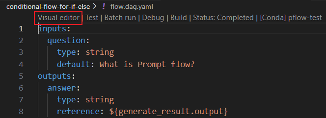
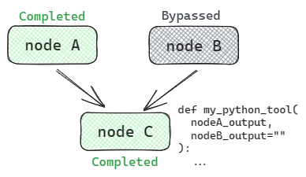
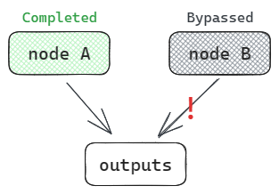
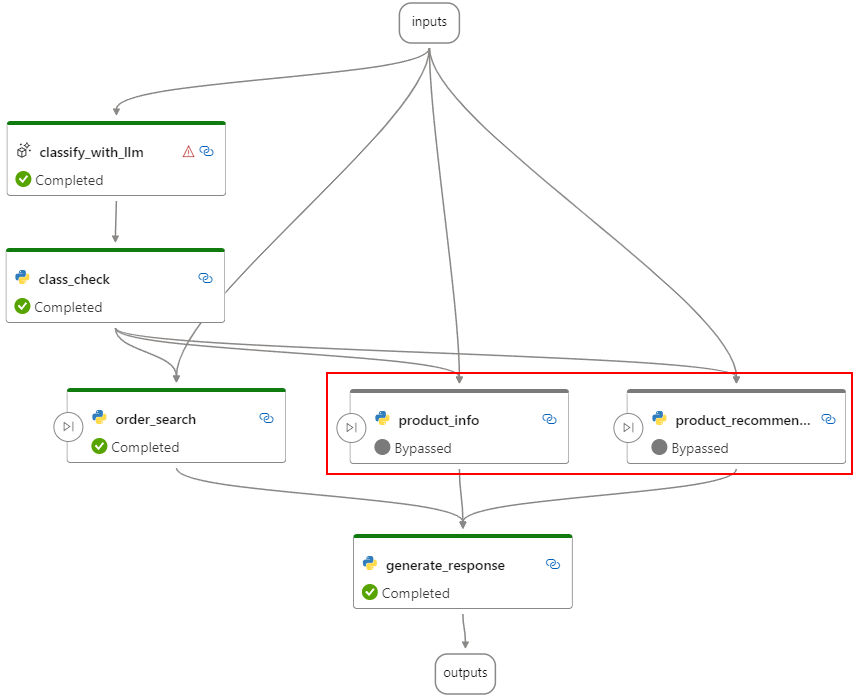
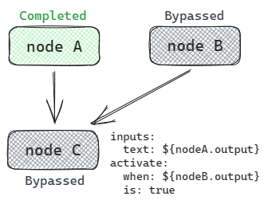

# Add conditional control to a flow

:::{admonition} Experimental feature
This is an experimental feature, and may change at any time. Learn [more](faq.md#stable-vs-experimental).
:::

In Prompt flow, we support control logic by activate config, like if-else, switch. Activate config enables conditional execution of nodes within your flow, ensuring that specific actions are taken only when the specified conditions are met.

This guide will help you learn how to use activate config to add conditional control to your flow.

## Prerequisites

Please ensure that your promptflow version is greater than `0.1.0b5`.

## Usage

Each node in your flow can have an associated activate config, specifying when it should execute and when it should bypass. If a node has activate config, it will only be executed when the activate condition is met. The configuration consists of two essential components:
- `activate.when`: The condition that triggers the execution of the node. It can be based on the outputs of a previous node, or the inputs of the flow.
- `activate.is`: The condition's value, which can be a constant value of string, boolean, integer, double.

You can manually change the flow.dag.yaml in the flow folder or use the visual editor in VS Code Extension to add activate config to nodes in the flow.

::::{tab-set}
:::{tab-item} YAML
:sync: YAML

You can add activate config in the node section of flow yaml.
```yaml
activate:
  when: ${node.output}
  is: true
```

:::

:::{tab-item} VS Code Extension
:sync: VS Code Extension

- Click `Visual editor` in the flow.dag.yaml to enter the flow interface.


- Click on the `Activation config` section in the node you want to add and fill in the values for "when" and "is".


:::

::::

### Further details and important notes
1. If the node using the python tool has an input that references a node that may be bypassed, please provide a default value for this input. This helps prevent errors in the current node due to missing parameters.

    

2. Please avoid directly connecting nodes that might be bypassed to the flow's outputs. This can lead to flow failures due to a lack of valid values on the flow output.

    

3. In a conditional flow, if a node has activate config, we will always use this config to determine whether the node should be bypassed. If a node is bypassed, its status will be marked as "Bypassed", as shown in the figure below Show. There are three situations in which a node is bypassed.

    


    (1) If a node has activate config and the value of `activate.when` is not equals to `activate.is`, it will be bypassed. If you want to fore a node to always be executed, you can set the activate config to `when dummy is dummy` which always meets the activate condition.

    

    (2) If a node has activate config and the node pointed to by `activate.when` is bypassed, it will be bypassed.

    

    (3) If a node does not have activate config but depends on other nodes that have been bypassed, it will be bypassed.

    


## Example flow

Let's illustrate how to use activate config with practical examples.

- If-Else scenario: Learn how to develop a conditional flow for if-else scenarios. [View Example](https://github.com/microsoft/promptflow/tree/main/examples/flows/standard/conditional-flow-for-if-else)
- Switch scenario: Explore conditional flow for switch scenarios. [View Example](https://github.com/microsoft/promptflow/tree/main/examples/flows/standard/conditional-flow-for-switch)


## Next steps

- [Run and evaluate a flow](./run-and-evaluate-a-flow/index.md)
