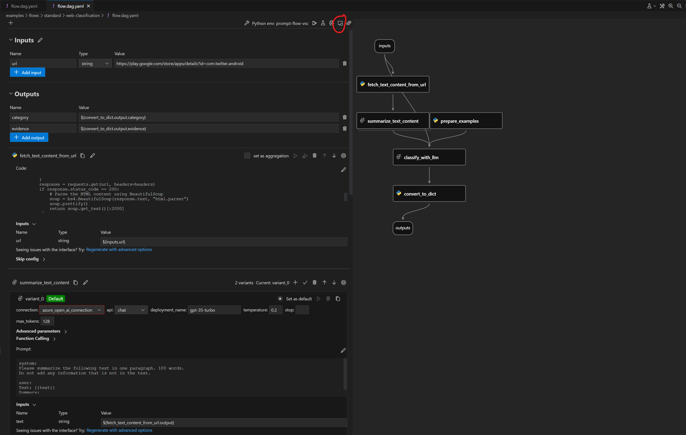
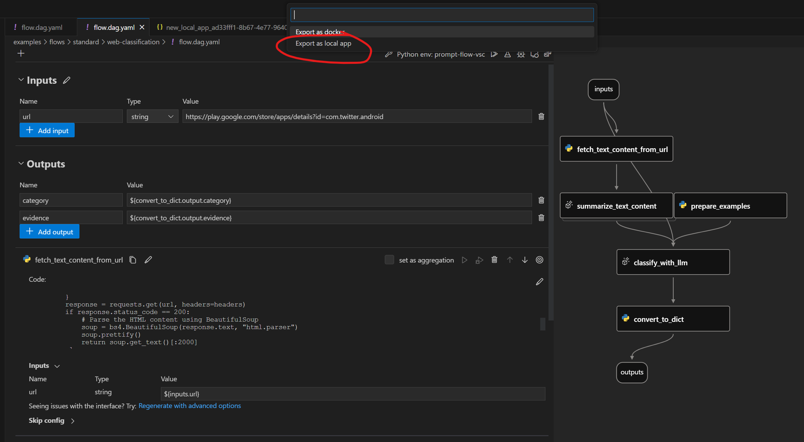

# Local deploy a flow
After build a flow and test it properly, the flow can be served as a http endpoint.

::::{tab-set}
:::{tab-item} CLI
:sync: CLI
We are going to use the [basic-with-connection flow](https://github.com/microsoft/promptflow/tree/main/examples/flows/standard/basic-with-connection) as
an example to show how to deploy a flow.

Please ensure you have [create the connection](../manage-connections.md#create-a-connection) required by flow, if not, you could simply create it by running the follow command.
```bash
pf connection create -f .\custom.yml --set configs.api_base=https://<to-be-replaced>.openai.azure.com/ secrets.api_key=<to-be-replaced>
```

The following CLI commands allows you serve a flow folder as an endpoint. By running this command, a [flask](https://flask.palletsprojects.com/en/) app will start in the environment where command is executed, please ensure all prerequisites required by flow have been installed.
```bash
# Serve the flow at localhost:8080
pf flow serve --source <path-to-your-flow-folder> --port 8080 --host localhost
```

The expected result is as follows if the flow served successfully, and the process will keep alive until it be killed manually.


:::
:::{tab-item} VS Code Extension
:sync: VSC


:::
::::

## Test endpoint
::::{tab-set}
:::{tab-item} Bash
You could open another terminal to test the endpoint with the following command:
```bash
curl http://localhost:8080/score --data '{"text":"Hello world!"}' -X POST  -H "Content-Type: application/json"
```
Test result:


:::
:::{tab-item} PowerShell
You could open another terminal to test the endpoint with the following command:
```powershell
Invoke-WebRequest -URI http://localhost:8080/score -Body '{"text":"Hello world!"}' -Method POST  -ContentType "application/json"
```
Test result:


:::
:::{tab-item} VS Code Extension

:::
::::


## Export a flow

Besides starting the service directly, a flow can also be exported as a sharable folder with a Dockerfile and its dependencies.

::::{tab-set}
:::{tab-item} CLI
:sync: CLI
```bash
pf flow export --source <path-to-your-flow-folder> --output <your-output-dir> --format docker
```
:::
:::{tab-item} VS Code Extension
:sync: VSC

:::
::::

You'll be asked to input a secret encryption key when running this command, 
which needs to be provided when you run the built docker image.
You can also provide the key via `--encryption-key` directly or passing it with a file via `--encryption-key-file`.

Note that all dependent connections must be created before exporting as docker.

More details about how to use the exported docker can be seen in `<your-output-dir>/README.md`. 

## Deploy a flow
[WIP]

## Next steps
- Try the deploy and export example [here](https://github.com/microsoft/promptflow/blob/main/examples/tutorials/flow-deploy/deploy.md).

