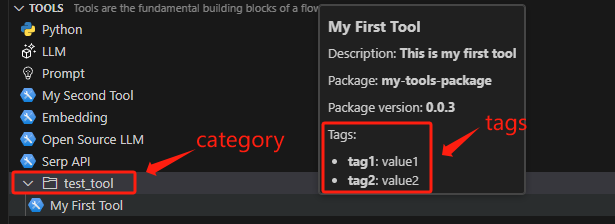

# Add Category and Tags for Tool
Previously, all tools are listed at the top level. It will be challenging for users to find their desired tool, especially when dozens of tools are installed. To simplify the tool list and help users locate their target tool more easily, we've introduced `category` and `tags` features. The `category` feature helps organize tools into separate folders, while `tags` allow users to search and filter tools with matching tags.

| name     | type | is_required | description |
| ---------| -----| ---------- | ----------- |
| category | str  | false      | A string that groups tools with similar characteristics. |
| tags     | dict | false      | A dictionary of key-value pairs to describe the different perspectives of the tool. |
> [!Note] If a tool isn't assigned a category, it will be displayed in the root folder. Similarly, if no tags are assigned, the tags field will remain empty.

## Prerequisites
- Please ensure that your [Prompt flow for VS Code](https://marketplace.visualstudio.com/items?itemName=prompt-flow.prompt-flow) is updated to version 1.1.0 or a more recent version.

## How to add category and tags for a tool
Here we use [an existing tool](https://github.com/microsoft/promptflow/tree/main/examples/tools/tool-package-quickstart/my_tool_package/yamls/my_tool_1.yaml) as an example. If you wish to create your own tool, kindly refer to the [create and use tool package](create-and-use-tool-package.md#create-custom-tool-package) guide. You can add the `category` and `tags` fields in the tool's YAML like this:
```yaml
my_tool_package.tools.my_tool_1.my_tool:
  function: my_tool
  inputs:
    connection:
      type:
      - CustomConnection
    input_text:
      type:
      - string
  module: my_tool_package.tools.my_tool_1
  name: My First Tool
  description: This is my first tool
  type: python
  # Add a category and tags as shown below.
  category: test_tool
  tags:
    tag1: value1
    tag2: value2
```

## Tool with category and tags shown in VS Code extension
Follow the [steps](create-and-use-tool-package.md#use-your-tool-from-vscode-extension) to use your tool via the VS Code extension. 
- User experience in tool tree  
Your tool will be displayed along with its category and tags in tool tree like this:  
  

- User experience in tool list  
By clicking `More` in the visual editor, you can view your tools along with their category and tags:  
  
Furthermore, you have the option to search or filter tools based on tags:  
  