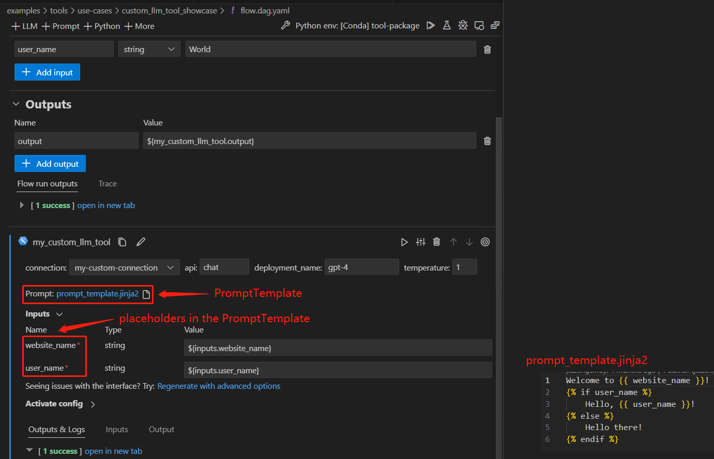
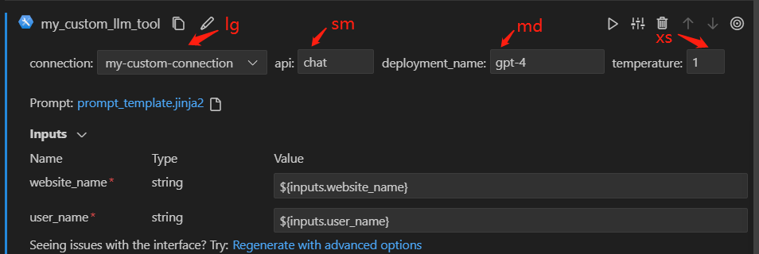

# Customizing an LLM Tool
In this document, we will guide you through the process of customizing an LLM tool, allowing users to seamlessly connect to a large language model with prompt tuning experience using a `PromptTemplate`.

## Prerequisites
- Please ensure that your [Prompt flow for VS Code](https://marketplace.visualstudio.com/items?itemName=prompt-flow.prompt-flow) is updated to version 1.8.0 or later.

## How to customize an LLM tool
Here we use [an existing tool package](https://github.com/microsoft/promptflow/tree/main/examples/tools/tool-package-quickstart/my_tool_package) as an example. If you want to create your own tool, please refer to [create and use tool package](create-and-use-tool-package.md).  

1. Develop the tool code as in [this example](https://github.com/microsoft/promptflow/blob/main/examples/tools/tool-package-quickstart/my_tool_package/tools/tool_with_custom_llm_type.py).
- Add a `CustomConnection` input to the tool, which is used to authenticate and establish a connection to the large language model.
- Add a `PromptTemplate` input to the tool, which serves as an argument to be passed into the large language model.

    ```python
    from jinja2 import Template
    from promptflow import tool
    from promptflow.connections import CustomConnection
    from promptflow.contracts.types import PromptTemplate


    @tool
    def my_tool(
        connection: CustomConnection,
        endpoint_name: str,
        api: str,
        temperature: float,
        prompt: PromptTemplate,
        **kwargs
    ) -> str:
        # Replace with your tool code, customise your own code to handle and use the prompt here.
        # Usually connection contains configs to connect to an API.
        # Not all tools need a connection. You can remove it if you don't need it.
        rendered_prompt = Template(prompt, trim_blocks=True, keep_trailing_newline=True).render(**kwargs)
        return rendered_prompt
    ```

2. Generate the custom LLM tool YAML.  
    Run the command below in your tool project directory to automatically generate your tool YAML, use _-t "custom_llm"_ or _--tool-type "custom_llm"_ to indicate this is a custom LLM tool:  
    ```
    python <promptflow github repo>\scripts\tool\generate_package_tool_meta.py -m <tool_module> -o <tool_yaml_path> -t "custom_llm"
    ```
    Here we use [an existing tool](https://github.com/microsoft/promptflow/blob/main/examples/tools/tool-package-quickstart/my_tool_package/tools/tool_with_custom_llm_type.py) as an example.
    ```
    cd D:\proj\github\promptflow\examples\tools\tool-package-quickstart

    python D:\proj\github\promptflow\scripts\tool\generate_package_tool_meta.py -m my_tool_package.tools.tool_with_custom_llm_type -o my_tool_package\yamls\tool_with_custom_llm_type.yaml -n "My Custom LLM Tool" -d "This is a tool to demonstrate how to customize an LLM tool with a PromptTemplate." -t "custom_llm"
    ```
    This command will generate a YAML file as follows:

    ```yaml
    my_tool_package.tools.tool_with_custom_llm_type.my_tool:
    name: My Custom LLM Tool
    # The type is custom_llm.
    type: custom_llm
    inputs:
      connection:
        type:
          - CustomConnection
      endpoint_name:
        type:
          - string
      api:
        type:
          - string
      temperature:
        type:
          - double
    description: This is a tool to demonstrate how to customize an LLM tool with a PromptTemplate.
    module: my_tool_package.tools.tool_with_custom_llm_type
    function: my_tool
    ```

## Use the tool in VS Code
Follow the steps to [build and install your tool package](create-and-use-tool-package.md#build-and-share-the-tool-package) and [use your tool from VS Code extension](create-and-use-tool-package.md#use-your-tool-from-vscode-extension).  

Here we use an existing flow to demonstrate the experience, open [this flow](https://github.com/microsoft/promptflow/blob/main/examples/tools/use-cases/custom_llm_tool_showcase/flow.dag.yaml) in VS Code extension.  
- There is a node named "my_custom_llm_tool" with a prompt template file. You can either use an existing file or create a new one as the prompt template file.  


## FAQs
### Can I customize text box size for my tool inputs?
Yes, you can add `ui_hints.text_box_size` field in your tool YAML file as below. There are 4 sizes available, arranged from smallest to largest as `xs`, `sm`, `md`, `lg`.
```yaml
my_tool_package.tools.tool_with_custom_llm_type.my_tool:
  name: My Custom LLM Tool
  description: This is a tool to demonstrate how to customize an LLM tool with a PromptTemplate.
  type: custom_llm
  module: my_tool_package.tools.tool_with_custom_llm_type
  function: my_tool
  inputs:
    connection:
      type:
        - CustomConnection
      ui_hints:
        text_box_size: lg
    endpoint_name:
      type:
      - string
      ui_hints:
        text_box_size: md
    api:
      type:
      - string
      ui_hints:
        text_box_size: sm
    temperature:
      type:
      - double
      ui_hints:
        text_box_size: xs
```
When you use the tool in [this example flow](https://github.com/microsoft/promptflow/blob/main/examples/tools/use-cases/custom_llm_tool_showcase/flow.dag.yaml), you could see the sizes of the input text boxes are displayed as the set values.
