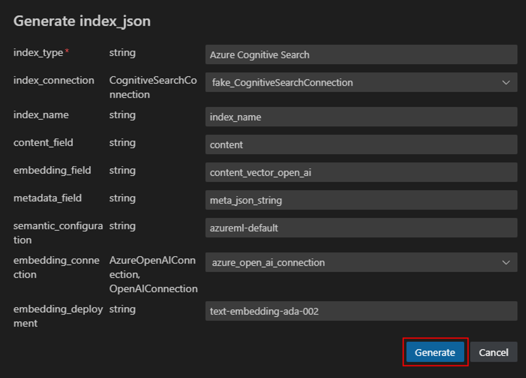
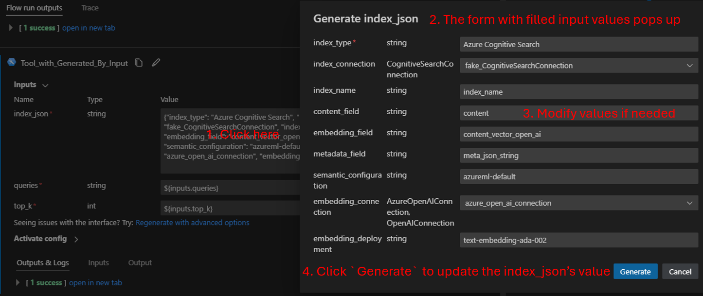

# Generate Tool Input Content through a Function
The content of a tool's input can be generated through a function, rather than manual entry by the user. This approach has several benefits. First, when the content of the tool input is complex, users only need to fill in the values for the function's parameters to generate the tool's input, which can increase efficiency. Second, the tool inputs can be separated from the function's parameters, with the function's parameters being displayed in a pop-up window, which can make the tool inputs more streamlined.

## Prerequisites

- Please make sure you have the latest version of [Prompt flow for VS Code](https://marketplace.visualstudio.com/items?itemName=prompt-flow.prompt-flow) installed (v1.8.0+).
- Please install promptflow package and ensure that its version is 1.3.0 or later.
  ```
  pip install promptflow>=1.3.0
  ```

## Create a tool with an input generated by a function

### Create an input-generating function and an input-reversing function
To enable generating tool input by a function, the tool author defines a pair of functions with the following structure:  
- input-generating function：It generates the content of the tool input.
  - Type: Regular Python function, can be in tool file or separate file
  - Input: Parameters needed to generate tool input content
  - Output: Tool input content, the type and format are defined by the tool author  # double check  

  See [generate_index_json](https://github.com/microsoft/promptflow/blob/main/examples/tools/tool-package-quickstart/my_tool_package/tools/tool_with_generated_by_input.py) as an example.

  ```python
  def generate_index_json(
      index_type: str,
      index: str = "",
      index_connection: CognitiveSearchConnection = "",
      index_name: str = "",
      content_field: str = "",
      embedding_field: str = "",
      metadata_field: str = "",
      semantic_configuration: str = "",
      embedding_connection: Union[AzureOpenAIConnection, OpenAIConnection] = "",
      embedding_deployment: str = ""
  ) -> str:
      """This is a dummy function to generate an index json based on the inputs.
      """

      import json
      inputs = ""
      if index_type == "Azure Cognitive Search":
          # 1. Call to create a new index
          # 2. Call to get the index yaml and return as a json
          inputs = {
              "index_type": index_type,
              "index": "retrieved_index",
              "index_connection": index_connection,
              "index_name": index_name,
              "content_field": content_field,
              "embedding_field": embedding_field,
              "metadata_field": metadata_field,
              "semantic_configuration": semantic_configuration,
              "embedding_connection": embedding_connection,
              "embedding_deployment": embedding_deployment
          }
      elif index_type == "Workspace MLIndex":
          # Call to get the index yaml and return as a json
          inputs = {
              "index_type": index_type,
              "index": index,
              "index_connection": "retrieved_index_connection",
              "index_name": "retrieved_index_name",
              "content_field": "retrieved_content_field",
              "embedding_field": "retrieved_embedding_field",
              "metadata_field": "retrieved_metadata_field",
              "semantic_configuration": "retrieved_semantic_configuration",
              "embedding_connection": "retrieved_embedding_connection",
              "embedding_deployment": "retrieved_embedding_deployment"
          }

      result = json.dumps(inputs)
      return result
  ```

- input-reversing function: It reverses the content of the tool input back into the values of the parameters for the input-generating function.
  - Type: Regular Python function, can be in tool file or separate file
  - Input: The output of the input-generating function
  - Output: Returns a dict as `Dict[str, object]`
    - Keys: The keys are the names of the parameters of the input-generating function
    - Values: The values and value types are corresponding to the input-generating function parameters.

  See [reverse_generate_index_json](https://github.com/microsoft/promptflow/blob/main/examples/tools/tool-package-quickstart/my_tool_package/tools/tool_with_generated_by_input.py) as an example.
  ```python
  def reverse_generate_index_json(index_json: str) -> Dict:
      """This is a dummy function to generate origin inputs from index_json.
      """
      import json

      # Calculate the UI inputs based on the index_json
      result = json.loads(index_json)
      return result
  ```

### Configure a tool input which can be generated by a function

In `inputs` section of the tool YAML, add following properties to the input that you want to be generated by a function:
- `generated_by`:
  - `func_path`: Path to the input-generating function
  - `func_kwargs`: Parameters pass to the function, can reference other input values.
  - `reverse_func_path`: Path to the input-reversing function

See [tool_with_generated_by_input.yaml](https://github.com/microsoft/promptflow/blob/main/examples/tools/tool-package-quickstart/my_tool_package/yamls/tool_with_generated_by_input.yaml) as an example.

```yaml
my_tool_package.tools.tool_with_generated_by_input.my_tool:
  function: my_tool
  inputs:
    # Assume this is the input you want to be generated by a function.
    index_json:
      type:
        - string
      # Add `generated_by` property for the input.
      generated_by:
        # Add input-generating function path in the `func_path` field.
        func_path: my_tool_package.tools.tool_with_generated_by_input.generate_index_json
        func_kwargs: 
        - name: index_type
          type: 
            - string
          reference: ${inputs.index_type}
        - name: index
          type:
            - string
          optional: true
          reference: ${inputs.index}
        # ...
        # Add input-reversing function path in the `reverse_func_path` field.
        reverse_func_path: my_tool_package.tools.tool_with_generated_by_input.reverse_generate_index_json
    queries:
      type:
        - string
    top_k:
      type:
        - int
    index_type:
      type:
        - string
      dynamic_list:
        func_path: my_tool_package.tools.tool_with_generated_by_input.list_index_types
      input_type: uionly_hidden
    # ...
  module: my_tool_package.tools.tool_with_generated_by_input
  name: Tool with Generated By Input
  description: This is a tool with generated by input
  type: python
```

## Use the tool in VS Code

Once you package and share your tool, you can use it in VS Code per the [tool package guide](create-and-use-tool-package.md#use-your-tool-from-vscode-extension). You could try `my-tools-package` for a quick test.

```sh
pip install my-tools-package>=0.0.12
```

- Choose the `Tool with Generated By Input` from `my-tools-package`.  
  

- When you click on the value input box for `index_json`, a form will pop up. In this form, you need to fill in the parameters required by the input-generating function corresponding to `index_json`. This function is defined under the path specified in the tool's YAML file in `index_json` input `generated_by: func_path` field.  
  
Popped up form:  
  

- After completing the form, you can click the `Generate` button to produce the input content for index_json. This process will invoke the input-generating function of `index_json`.  
  

- If you want to modify the contents of `index_json`, you can click on the value input box for `index_json` again. The form that pops up will have all the parameters you previously filled (This process will invoke the `index_json`'s input-reversing function, which is defined under the path specified in the tool's YAML file in `index_json` input `generated_by: func_path` field). After making changes to the parameters, click the `Generate` button again to create new content for `index_json`.  
  
