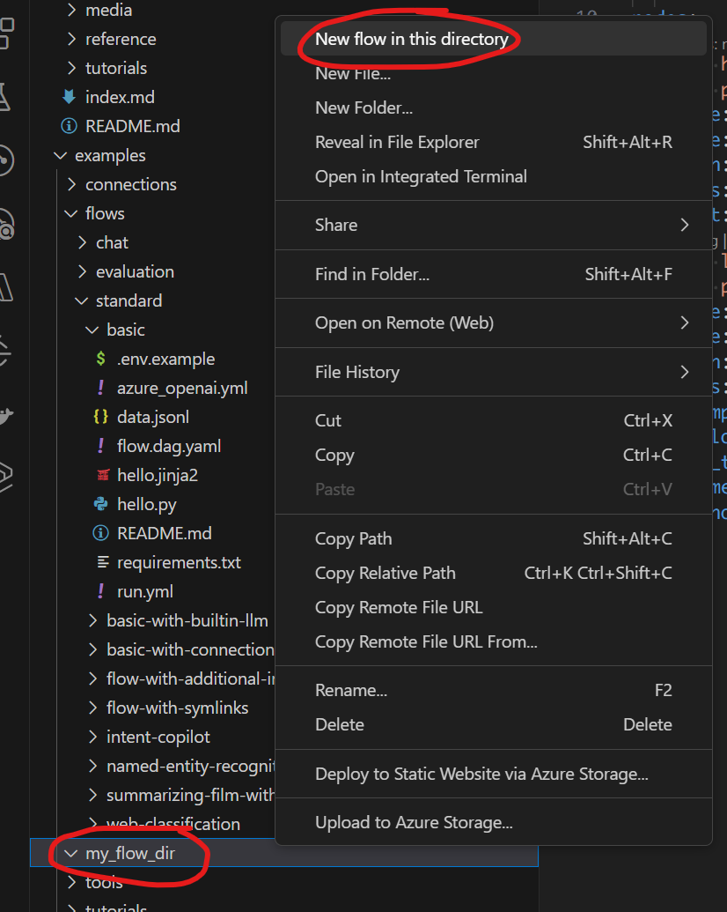
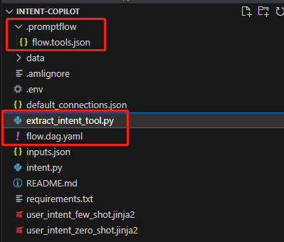
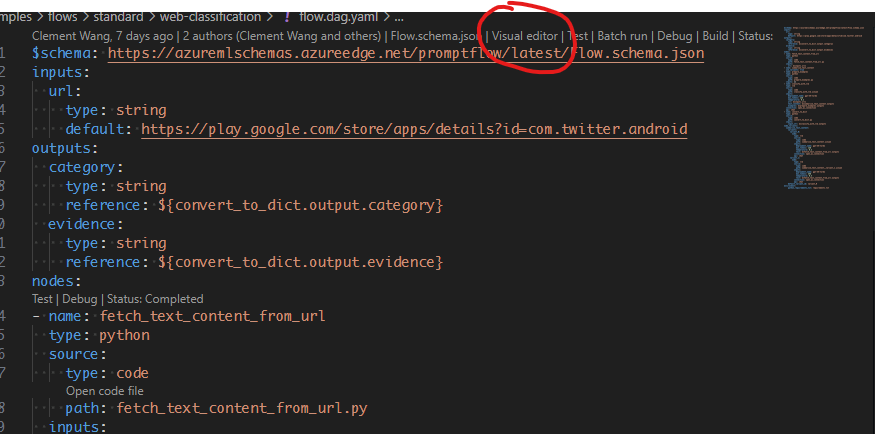
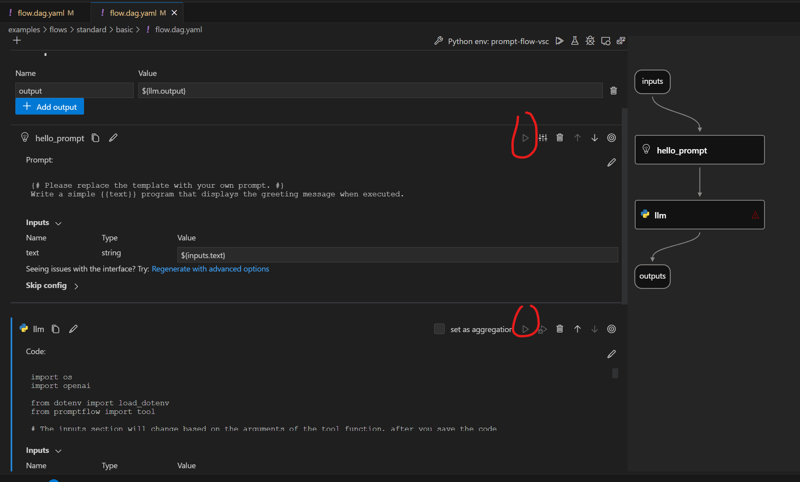
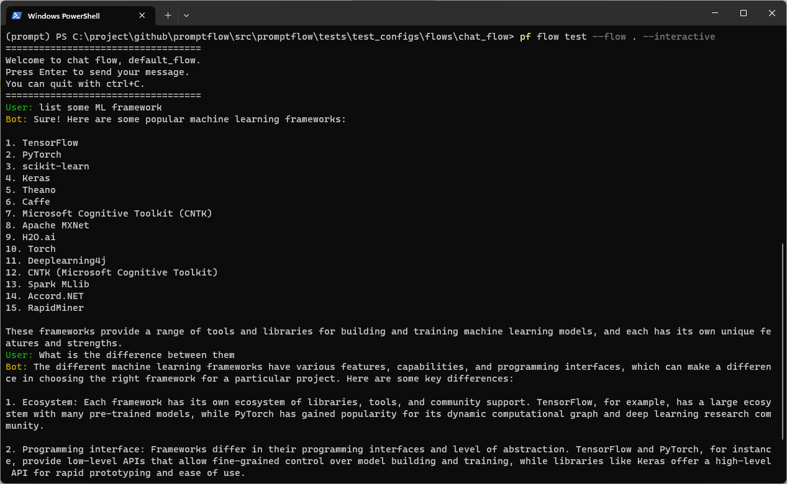
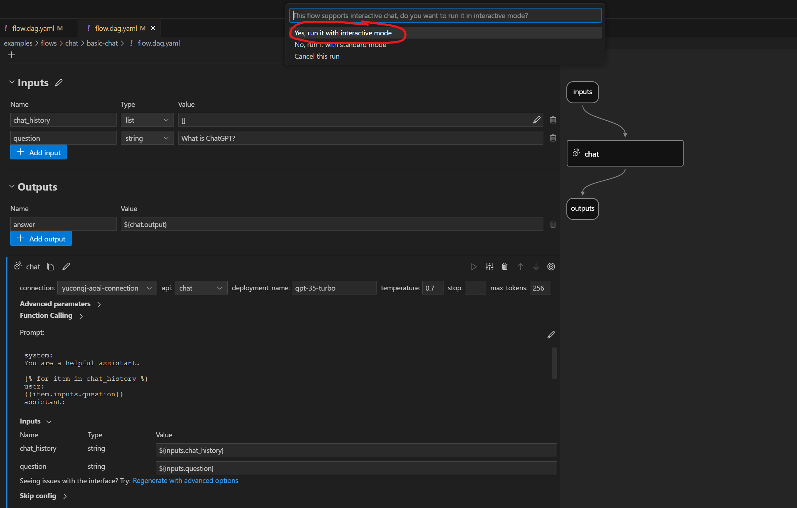
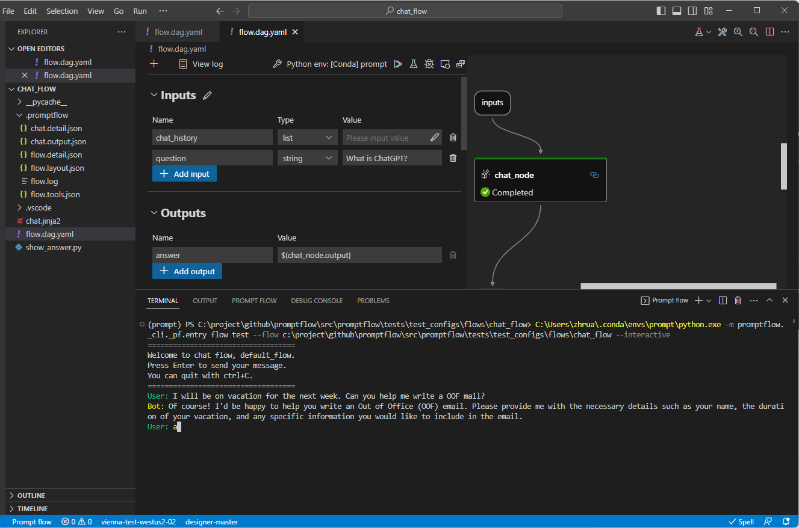
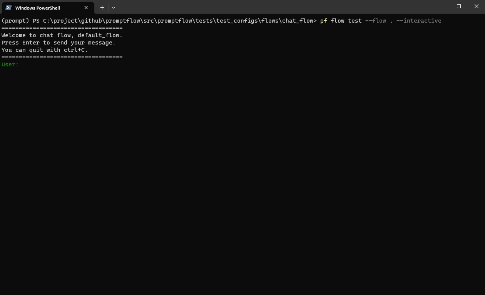
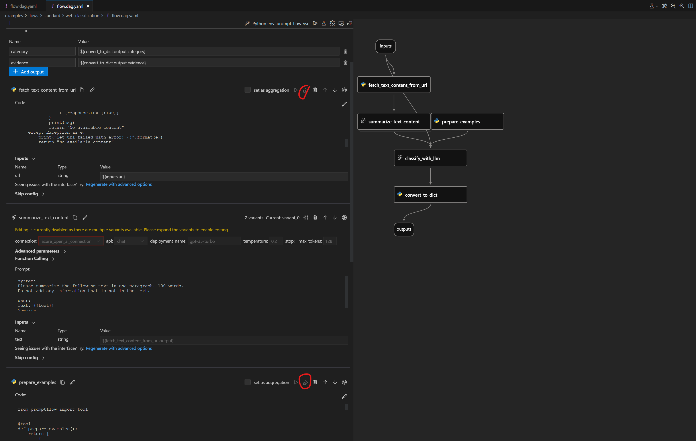

# Initialize and test a flow

:::{admonition} Experimental feature
This is an experimental feature, and may change at any time. Learn [more](faq.md#stable-vs-experimental).
:::

From this document, customer can initialize a flow and test it.

## Initialize flow

Creating a flow folder with code/prompts and yaml definitions of the flow.

### Initialize flow from scratch

Promptflow can [create three types of flow folder](https://promptflow.azurewebsites.net/concepts/concept-flows.html#flow-types):
- standard: Basic structure of flow folder.
- chat: Chat flow is designed for conversational application development, building upon the capabilities of standard flow and providing enhanced support for chat inputs/outputs and chat history management.
- evaluation: Evaluation flows are special types of flows that assess how well the outputs of a flow align with specific criteria and goals.

::::{tab-set}
:::{tab-item} CLI
:sync: CLI

```bash
# Create a flow
pf flow init --flow <flow-name>

# Create a chat flow
pf flow init --flow <flow-name> --type chat
```
:::

:::{tab-item} VS Code Extension
:sync: VS Code Extension

Use VS Code explorer pane > directory icon > right click > the "New flow in this directory" action. Follow the popped out dialog to initialize your flow in the target folder.


Alternatively, you can use the "Create new flow" action on the Prompt flow pane > quick access section to create a new flow


:::

::::


Structure of flow folder:
- **flow.dag.yaml**: The flow definition with inputs/outputs, nodes, tools and variants for authoring purpose.
- **.promptflow/flow.tools.json**: It contains all package tools meta that references in `flow.dag.yaml`.
- **Source code files (.py, .jinja2)**: User managed, the code scripts that references by tools.
- **requirements.txt**: Python package dependencies for this flow.


### Create from existing code

Promptflow CLI can generate the yaml definitions needed for prompt flow from the existing folder, using the tools script and prompt templates.

```bash
# Create a flow in existing folder
pf flow init --flow <flow-name> --entry <entry-file-name> --function <tool-function-name> --prompt-template <prompt-tempate>
```

Take [customer-intent-extraction](https://github.com/microsoft/promptflow/tree/main/examples/flows/standard/customer-intent-extraction) for example, which demonstrating how to convert a langchain code into a prompt flow.


In this case, promptflow CLI generates `flow.dag.json`, `.promptflow/tools.json`  and `extract_intent_tool.py`, it is a python tool in the flow.


## Test a flow

Promptflow also provides ways to test the initialized flow or flow node. It will help you quickly test your flow.

### Visual editor on the VS Code for Prompt flow.

::::{tab-set}
:::{tab-item} VS Code Extension
:sync: VS Code Extension

Open the flow.dag.yaml file of your flow. On the top of the yaml editor you can find the "Visual editor" action. Use it to open the Visual editor with GUI support.


:::

::::

### Test flow

Customer can use CLI or VS Code extension to test the flow.

::::{tab-set}
:::{tab-item} CLI
:sync: CLI

```bash
# Test flow
pf flow test --flow <flow-name>

# Test flow with specified variant
pf flow test --flow <flow-name> --variant '${<node-name>.<variant-name>}'
```

The log and result of flow test will be displayed in the terminal.


Promptflow CLI will generate test logs and outputs in `.promptflow`:
- **flow.detail.json**: Defails info of flow test, include the result of each node.
- **flow.log**: The log of flow test.
- **flow.output.json**: The result of flow test.


:::

:::{tab-item} SDK
:sync: SDK

The return value of `test` function is the flow outputs.

```python
from promptflow import PFClient

pf_client = PFClient()

# Test flow
inputs = {"<flow_input_name>": "<flow_input_value>"}  # The inputs of the flow.
flow_result = pf_client.test(flow="<flow_folder_path>", inputs=inputs)
print(f"Flow outputs: {flow_result}")
```

The log and result of flow test will be displayed in the terminal.


Promptflow CLI will generate test logs and outputs in `.promptflow`:
- **flow.detail.json**: Defails info of flow test, include the result of each node.
- **flow.log**: The log of flow test.
- **flow.output.json**: The result of flow test.


:::

:::{tab-item} VS Code Extension
:sync: VS Code Extension

You can use the action either on the default yaml editor or the visual editor to trigger flow test. See the snapshots below:


:::

::::


### Test a single node in the flow

Customer can test a single python node in the flow. It will use customer provides date or the default value of the node as input. It will only use customer specified node to execute with the input.

::::{tab-set}
:::{tab-item} CLI
:sync: CLI

Customer can execute this command to test the flow.

```bash
# Test flow node
pf flow test --flow <flow-name> --node <node-name>
```

The log and result of flow node test will be displayed in the terminal. And the details of node test will generated to `.promptflow/flow-<node-name>.node.detail.json`.

:::

:::{tab-item} SDK
:sync: SDK

Customer can execute this command to test the flow. The return value of `test` function is the node outputs.

```python
from promptflow import PFClient

pf_client = PFClient()

# Test not iun the flow
inputs = {<node_input_name>: <node_input_value>}  # The inputs of the node.
node_result = pf_client.test(flow=<flow_folder_path>, inputs=inputs, node=<node_name>)
print(f"Node outputs: {node_result}")
```

The log and result of flow node test will be displayed in the terminal. And the details of node test will generated to `.promptflow/flow-<node-name>.node.detail.json`.

:::

:::{tab-item} VS Code Extension
:sync: VS Code Extension

The Prompt flow extension provides inline actions in both default yaml editor and visual editor to trigger single node runs.




:::

::::

### Test with interactive mode


::::{tab-set}
:::{tab-item} CLI
:sync: CLI

Promptflow CLI provides a way to start an interactive chat session for chat flow. Customer can use below command to start an interactive chat session:

```bash
# Chat in the flow
pf flow test --flow <flow-name> --interactive
```

After executing this command, customer can interact with the chat flow in the terminal. Customer can press **Enter** to send the message to chat flow. And customer can quit with **ctrl+Z**.
Promptflow CLI will distinguish the output of different roles by color, <span style="color:Green">User input</span>, <span style="color:Gold">Bot output</span>, <span style="color:Blue">Flow script output</span>, <span style="color:Cyan">Node output</span>.

Using this [chat flow](https://github.com/microsoft/promptflow/tree/main/examples/flows/chat/basic-chat) to show how to use interactive mode.



:::

:::{tab-item} VS Code Extension
:sync: VS Code Extension

If a flow contains chat inputs or chat outputs in the flow interface, there will be a selection when triggering flow test. You can select the interactive mode if you want to.




:::

::::

When the [LLM node](https://promptflow.azurewebsites.net/tools-reference/llm-tool.html) in the chat flow that is connected to the flow output, Promptflow SDK streams the results of the LLM node.

::::{tab-set}
:::{tab-item} CLI
:sync: CLI
The flow result will be streamed in the terminal as shown below.



:::

:::{tab-item} SDK
:sync: SDK

The LLM node return value of `test` function is a generator, you can consume the result by this way:

```python
from promptflow import PFClient

pf_client = PFClient()

# Test flow
inputs = {"<flow_input_name>": "<flow_input_value>"}  # The inputs of the flow.
flow_result = pf_client.test(flow="<flow_folder_path>", inputs=inputs)
for item in flow_result["<LLM node output>"]:
    print(item)
```

:::

::::

### Debug a single node in the flow

Customer can debug a single python node in VScode by the extension.

::::{tab-set}
:::{tab-item} VS Code Extension
:sync: VS Code Extension

Break points and debugging functionalities for the Python steps in your flow. Just set the break points and use the debug actions on either default yaml editor or visual editor.



:::

::::


## Next steps

- [Run and evaluate a flow](./run-and-evaluate-a-flow.md)