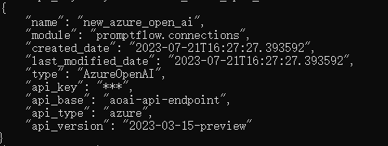
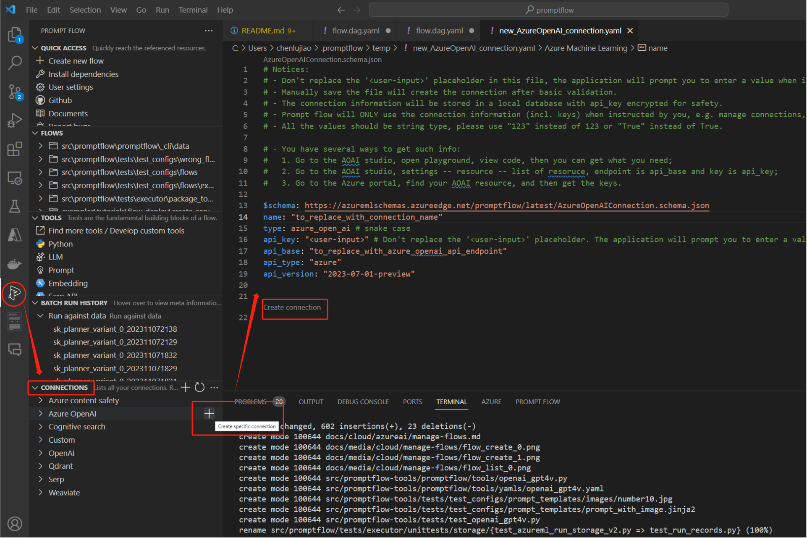
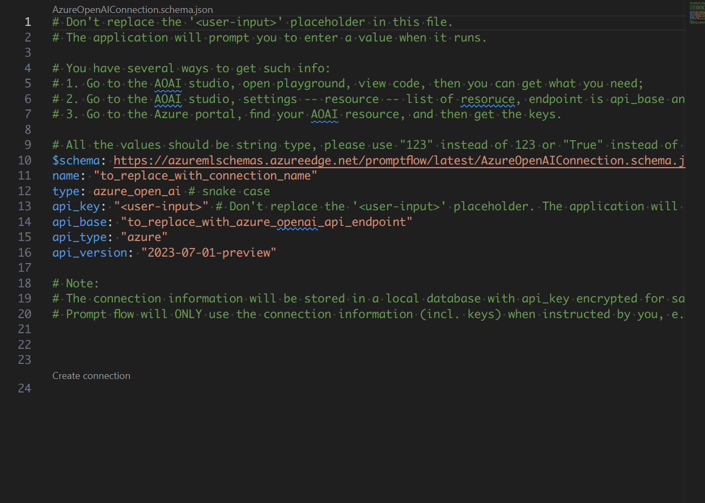
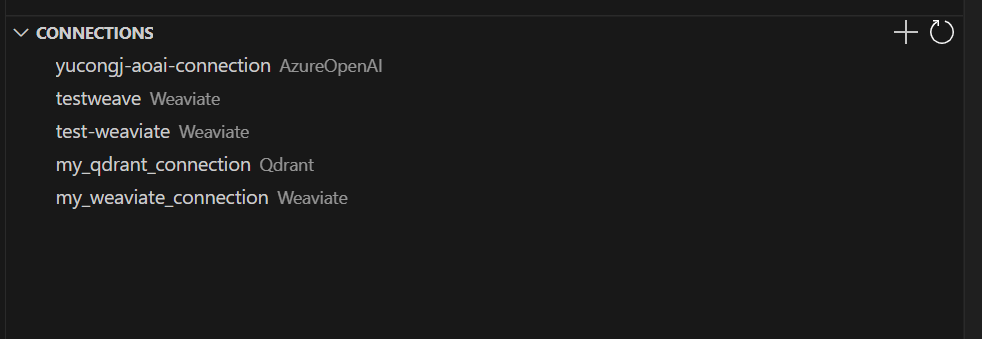

# Manage connections

:::{admonition} Experimental feature
This is an experimental feature, and may change at any time. Learn [more](faq.md#stable-vs-experimental).
:::

[Connection](../../concepts/concept-connections.md) helps securely store and manage secret keys or other sensitive credentials required for interacting with LLM (Large Language Models) and other external tools, for example, Azure Content Safety.

:::{note}
This document target for manage connections locally. To use Azure AI connections locally, refer to [this guide](../cloud/azureai/consume-connections-from-azure-ai.md).
:::

## Connection types
There are multiple types of connections supported in promptflow, which can be simply categorized into **strong type connection** and **custom connection**. The strong type connection includes AzureOpenAIConnection, OpenAIConnection, etc. The custom connection is a generic connection type that can be used to store custom defined credentials.

We are going to use AzureOpenAIConnection as an example for strong type connection, and CustomConnection to show how to manage connections.

## Create a connection

:::{note}
If you are using `WSL` or other OS without default keyring storage backend, you may encounter `StoreConnectionEncryptionKeyError`, please refer to [FAQ](./faq.md#connection-creation-failed-with-storeconnectionencryptionkeyerror) for the solutions.
:::

::::{tab-set}
:::{tab-item} CLI
:sync: CLI
Each of the strong type connection has a corresponding yaml schema, the example below shows the AzureOpenAIConnection yaml:
```yaml
$schema: https://azuremlschemas.azureedge.net/promptflow/latest/AzureOpenAIConnection.schema.json
name: azure_open_ai_connection
type: azure_open_ai
api_key: "<to-be-replaced>"
api_base: "https://<name>.openai.azure.com/"
api_type: "azure"
api_version: "2023-03-15-preview"
```
The custom connection yaml will have two dict fields for secrets and configs, the example below shows the CustomConnection yaml:
```yaml
$schema: https://azuremlschemas.azureedge.net/promptflow/latest/CustomConnection.schema.json
name: custom_connection
type: custom
configs:
  endpoint: "<your-endpoint>"
  other_config: "other_value"
secrets:  # required
  my_key: "<your-api-key>"
```
After preparing the yaml file, use the CLI command below to create them:
```bash
# Override keys with --set to avoid yaml file changes
pf connection create -f <path-to-azure-open-ai-connection> --set api_key=<your-api-key>
# Create the custom connection
pf connection create -f <path-to-custom-connection> --set configs.endpoint=<endpoint> secrets.my_key=<your-api-key>
```
The expected result is as follows if the connection created successfully.


:::


:::{tab-item} SDK
:sync: SDK
Using SDK, each connection type has a corresponding class to create a connection. The following code snippet shows how to import the required class and create the connection:

```python
from promptflow import PFClient
from promptflow.entities import AzureOpenAIConnection, CustomConnection

# Get a pf client to manage connections
pf = PFClient()

# Initialize an AzureOpenAIConnection object
connection = AzureOpenAIConnection(
    name="my_azure_open_ai_connection", 
    api_key="<your-api-key>", 
    api_base="<your-endpoint>"
    api_version="2023-03-15-preview"
)

# Create the connection, note that api_key will be scrubbed in the returned result
result = pf.connections.create_or_update(connection)
print(result)

# Initialize a custom connection object
connection = CustomConnection(
    name="my_custom_connection", 
    # Secrets is a required field for custom connection
    secrets={"my_key": "<your-api-key>"},
    configs={"endpoint": "<your-endpoint>", "other_config": "other_value"}
)

# Create the connection, note that all secret values will be scrubbed in the returned result
result = pf.connections.create_or_update(connection)
print(result)
```
:::

:::{tab-item} VS Code Extension
:sync: VSC

On the VS Code primary sidebar > prompt flow pane. You can find the connections pane to manage your local connections. Click the "+" icon on the top right of it and follow the popped out instructions to create your new connection.



:::
::::

## Update a connection

::::{tab-set}
:::{tab-item} CLI
:sync: CLI
The commands below show how to update existing connections with new values:
```bash
# Update an azure open ai connection with a new api base
pf connection update -n my_azure_open_ai_connection --set api_base='new_value'
# Update a custom connection
pf connection update -n my_custom_connection --set configs.other_config='new_value'
```
:::


:::{tab-item} SDK
:sync: SDK
The code snippet below shows how to update existing connections with new values:
```python
# Update an azure open ai connection with a new api base
connection = pf.connections.get(name="my_azure_open_ai_connection")
connection.api_base = "new_value"
connection.api_key = "<original-key>"  # secrets are required when updating connection using sdk
result = pf.connections.create_or_update(connection)
print(connection)
# Update a custom connection
connection = pf.connections.get(name="my_custom_connection")
connection.configs["other_config"] = "new_value"
connection.secrets = {"key1": "val1"}  # secrets are required when updating connection using sdk
result = pf.connections.create_or_update(connection)
print(connection)
```
:::

:::{tab-item} VS Code Extension
:sync: VSC

On the VS Code primary sidebar > prompt flow pane. You can find the connections pane to manage your local connections. Right click the item of the connection list to update or delete your connections.

:::
::::

## List connections
::::{tab-set}
:::{tab-item} CLI
:sync: CLI
List connection command will return the connections with json list format, note that all secrets and api keys will be scrubbed:
```bash
pf connection list
```
:::


:::{tab-item} SDK
:sync: SDK
List connection command will return the connections object list, note that all secrets and api keys will be scrubbed:
```python
from promptflow import PFClient
# Get a pf client to manage connections
pf = PFClient()
# List and print connections
connection_list = pf.connections.list()
for connection in connection_list:
    print(connection)
```
:::

:::{tab-item} VS Code Extension
:sync: VSC

:::
::::

## Delete a connection
::::{tab-set}
:::{tab-item} CLI
:sync: CLI
Delete a connection with the following command:
```bash
pf connection delete -n <connection_name>
```
:::


:::{tab-item} SDK
:sync: SDK
Delete a connection with the following code snippet:
```python
from promptflow import PFClient

# Get a pf client to manage connections
pf = PFClient()
# Delete the connection with specific name
client.connections.delete(name="my_custom_connection")
```
:::

:::{tab-item} VS Code Extension
:sync: VSC

On the VS Code primary sidebar > prompt flow pane. You can find the connections pane to manage your local connections. Right click the item of the connection list to update or delete your connections.

:::
::::

## Load from environment variables
With `promptflow>=1.7.0`, user is able to load a connection object from os environment variables with `<ConnectionType>.from_env` func.
Note that the connection object will **NOT BE CREATED** to local database.

Supported types are as follows:

| Connection Type       | Field | Relevant Environment Variable                    |
|-----------------------| --- |--------------------------------------------------|
| OpenAIConnection | api_key | OPENAI_API_KEY                                   |
|  | organization | OPENAI_ORG_ID                                    |
|  | base_url | OPENAI_BASE_URL                                  |
| AzureOpenAIConnection | api_key | AZURE_OPENAI_API_KEY                             |
|  | api_base | AZURE_OPENAI_ENDPOINT                            |
|  | api_version | OPENAI_API_VERSION |

For example, with `OPENAI_API_KEY` set to environment, an `OpenAIConnection` object can be loaded with `OpenAIConnection.from_env()`.


## Next steps
- Reach more detail about [connection concepts](../../concepts/concept-connections.md).
- Try the [connection samples](https://github.com/microsoft/promptflow/blob/main/examples/connections/connection.ipynb).
- [Consume connections from Azure AI](../cloud/azureai/consume-connections-from-azure-ai.md).
