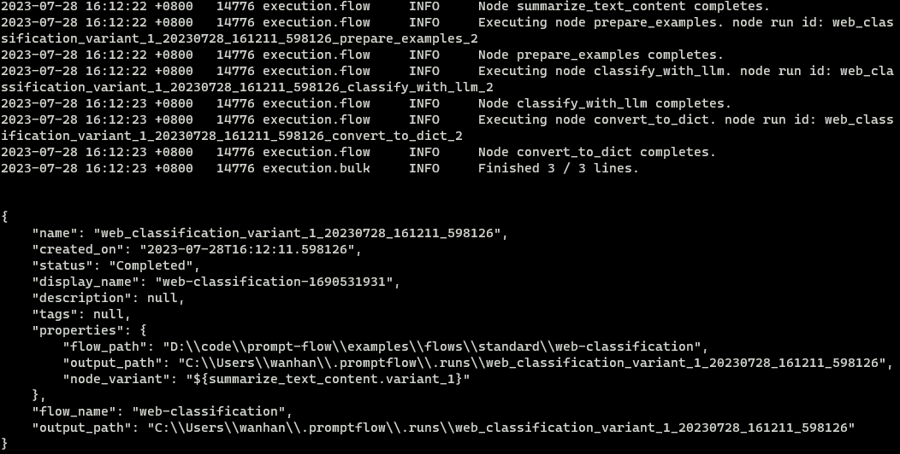
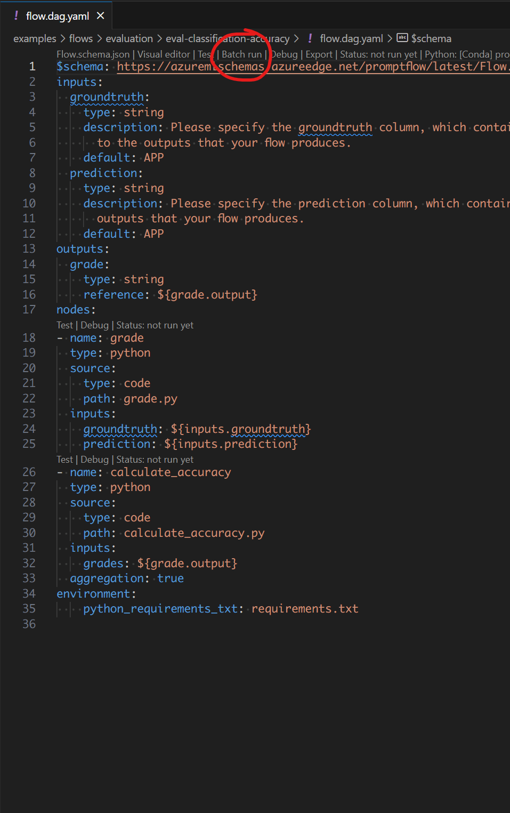
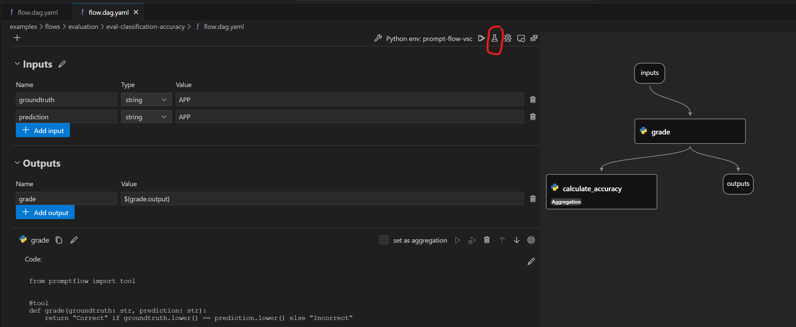
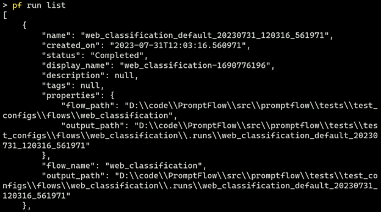
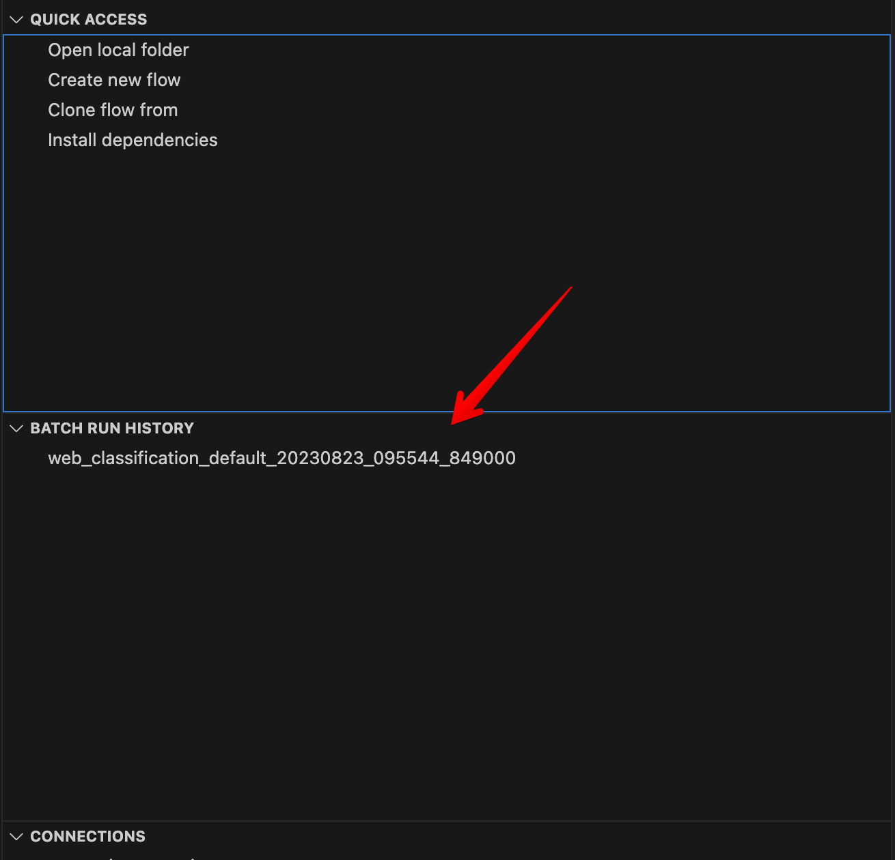

# Manage runs

:::{admonition} Experimental feature
This is an experimental feature, and may change at any time. Learn [more](faq.md#stable-vs-experimental).
:::

This documentation will walk you through how to manage your runs with CLI, SDK and VS Code Extension.

In general:
- For `CLI`, you can run `pf/pfazure run --help` in terminal to see the help messages.
- For `SDK`, you can refer to [Promptflow Python Library Reference](../reference/python-library-reference/promptflow.md) and check `PFClient.runs` for more run operations.

Let's take a look at the following topics:

- [Manage runs](#manage-runs)
  - [Create a run](#create-a-run)
  - [Get a run](#get-a-run)
  - [Show run details](#show-run-details)
  - [Show run metrics](#show-run-metrics)
  - [Visualize a run](#visualize-a-run)
  - [List runs](#list-runs)
  - [Update a run](#update-a-run)
  - [Archive a run](#archive-a-run)
  - [Restore a run](#restore-a-run)
  - [Delete a run](#delete-a-run)

## Create a run

::::{tab-set}
:::{tab-item} CLI
:sync: CLI
To create a run against bulk inputs, you can write the following YAML file.

```yaml
$schema: https://azuremlschemas.azureedge.net/promptflow/latest/Run.schema.json
flow: ../web_classification
data: ../webClassification1.jsonl
column_mapping:
   url: "${data.url}"
variant: ${summarize_text_content.variant_0}
```

To create a run against existing run, you can write the following YAML file.

```yaml
$schema: https://azuremlschemas.azureedge.net/promptflow/latest/Run.schema.json
flow: ../classification_accuracy_evaluation
data: ../webClassification1.jsonl
column_mapping:
   groundtruth: "${data.answer}"
   prediction: "${run.outputs.category}"
run: <existing-flow-run-name>
```

Reference [here](https://aka.ms/pf/column-mapping) for detailed information for column mapping.
You can find additional information about flow yaml schema in [Run YAML Schema](../reference/run-yaml-schema-reference.md).

After preparing the yaml file, use the CLI command below to create them:

```bash
# create the flow run
pf run create -f <path-to-flow-run>

# create the flow run and stream output
pf run create -f <path-to-flow-run> --stream
```

The expected result is as follows if the run is created successfully.


:::


:::{tab-item} SDK
:sync: SDK
Using SDK, create `Run` object and submit it with `PFClient`. The following code snippet shows how to import the required class and create the run:

```python
from promptflow.client import PFClient
from promptflow.entities import Run

# Get a pf client to manage runs
pf = PFClient()

# Initialize an Run object
run = Run(
    flow="<path-to-local-flow>",
    # run flow against local data or existing run, only one of data & run can be specified.
    data="<path-to-data>",
    run="<existing-run-name>",
    column_mapping={"url": "${data.url}"},
    variant="${summarize_text_content.variant_0}"
)

# Create the run
result = pf.runs.create_or_update(run)
print(result)

```
:::

:::{tab-item} VS Code Extension
:sync: VS Code Extension

You can click on the actions on the top of the default yaml editor or the visual editor for the flow.dag.yaml files to trigger flow batch runs.



:::
::::

## Get a run

::::{tab-set}
:::{tab-item} CLI
:sync: CLI

Get a run in CLI with JSON format.

```bash
pf run show --name <run-name>
```


:::


:::{tab-item} SDK
:sync: SDK
Show run with `PFClient`
```python
from promptflow.client import PFClient
# Get a pf client to manage runs
pf = PFClient()
# Get and print the run
run = pf.runs.get(name="<run-name>")
print(run)
```
:::

:::{tab-item} VS Code Extension
:sync: VSC

:::
::::

## Show run details

::::{tab-set}
:::{tab-item} CLI
:sync: CLI

Get run details with TABLE format.

```bash
pf run show-details --name <run-name>
```


:::


:::{tab-item} SDK
:sync: SDK
Show run details with `PFClient`
```python
from promptflow.client import PFClient
from tabulate import tabulate

# Get a pf client to manage runs
pf = PFClient()
# Get and print the run-details
run_details = pf.runs.get_details(name="<run-name>")
print(tabulate(details.head(max_results), headers="keys", tablefmt="grid"))
```
:::

:::{tab-item} VS Code Extension
:sync: VSC

:::
::::

## Show run metrics

::::{tab-set}
:::{tab-item} CLI
:sync: CLI

Get run metrics with JSON format.

```bash
pf run show-metrics --name <run-name>
```


:::


:::{tab-item} SDK
:sync: SDK
Show run metrics with `PFClient`
```python
from promptflow.client import PFClient
import json

# Get a pf client to manage runs
pf = PFClient()
# Get and print the run-metrics
run_details = pf.runs.get_metrics(name="<run-name>")
print(json.dumps(metrics, indent=4))
```
:::

::::

## Visualize a run

::::{tab-set}
:::{tab-item} CLI
:sync: CLI

Visualize run in browser.

```bash
pf run visualize --names <run-name>
```

A browser will open and display run outputs.


:::


:::{tab-item} SDK
:sync: SDK
Visualize run with `PFClient`
```python
from promptflow.client import PFClient

# Get a pf client to manage runs
pf = PFClient()
# Visualize the run
client.runs.visualize(runs="<run-name>")
```
:::

:::{tab-item} VS Code Extension
:sync: VSC

On the VS Code primary sidebar > the prompt flow pane, there is a run list. It will list all the runs on your machine. Select one or more items and click the "visualize" button on the top-right to visualize the local runs.


:::
::::

## List runs


::::{tab-set}
:::{tab-item} CLI
:sync: CLI

List runs with JSON format.

```bash
pf run list
```



:::


:::{tab-item} SDK
:sync: SDK
List with `PFClient`
```python
from promptflow.client import PFClient

# Get a pf client to manage runs
pf = PFClient()
# list runs
runs = pf.runs.list()
print(runs)
```
:::

:::{tab-item} VS Code Extension
:sync: VSC

On the VS Code primary sidebar > the prompt flow pane, there is a run list. It will list all the runs on your machine. Hover on it to view more details.

:::
::::

## Update a run

::::{tab-set}
:::{tab-item} CLI
:sync: CLI

Get run metrics with JSON format.

```bash
pf run update --name <run-name> --set display_name=new_display_name
```

:::


:::{tab-item} SDK
:sync: SDK
Update run with `PFClient`
```python
from promptflow.client import PFClient

# Get a pf client to manage runs
pf = PFClient()
# Get and print the run-metrics
run = pf.runs.update(name="<run-name>", display_name="new_display_name")
print(run)
```
:::
::::

## Archive a run

::::{tab-set}
:::{tab-item} CLI
:sync: CLI

Archive the run so it won't show in run list results.

```bash
pf run archive --name <run-name>
```
:::


:::{tab-item} SDK
:sync: SDK
Archive with `PFClient`
```python
from promptflow.client import PFClient

# Get a pf client to manage runs
pf = PFClient()
# archive a run
client.runs.archive(name="<run-name>")
```
:::

:::{tab-item} VS Code Extension
:sync: VSC

:::
::::

## Restore a run

::::{tab-set}
:::{tab-item} CLI
:sync: CLI

Restore an archived run so it can show in run list results.

```bash
pf run restore --name <run-name>
```
:::


:::{tab-item} SDK
:sync: SDK
Restore with `PFClient`
```python
from promptflow.client import PFClient

# Get a pf client to manage runs
pf = PFClient()
# restore a run
client.runs.restore(name="<run-name>")
```
:::
::::

## Delete a run

::::{tab-set}
:::{tab-item} CLI
:sync: CLI

Caution: pf run delete is irreversible. This operation will delete the run permanently from your local disk. Both run entity and output data will be deleted.

Delete will fail if the run name is not valid.

```bash
pf run delete --name <run-name>
```
:::


:::{tab-item} SDK
:sync: SDK
Delete with `PFClient`
```python
from promptflow.client import PFClient

# Get a pf client to manage runs
pf = PFClient()
# delete a run
client.runs.delete(name="run-name")
```
:::
::::