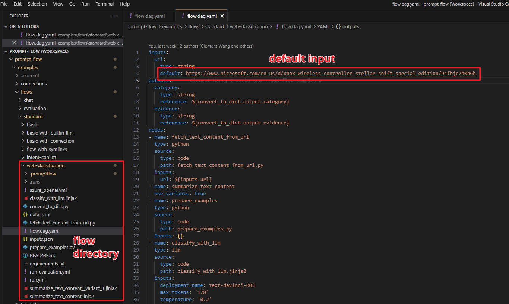
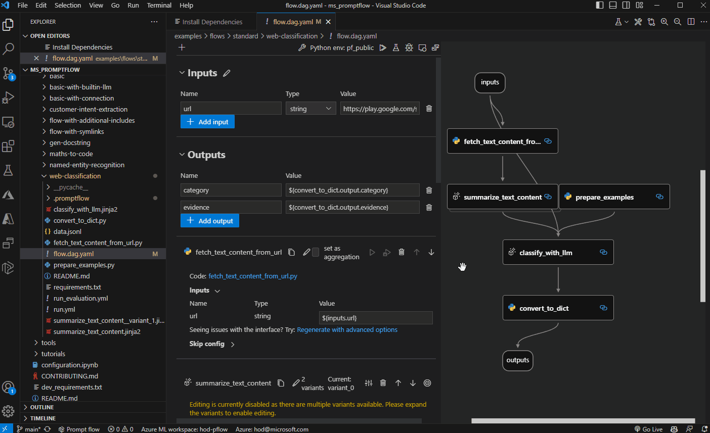

# Quick start

[**Prompt flow**](https://github.com/microsoft/promptflow) is a suite of development tools designed to streamline the end-to-end development cycle of LLM-based AI applications, from ideation, prototyping, testing, evaluation to production deployment and monitoring. It makes prompt engineering much easier and enables you to build LLM apps with production quality.

## Installation

Install promptflow package to start.
```sh
pip install promptflow
```
Learn more on installation topic.

## Develop and test your first flow

Create a Prompty file to help you trigger one LLM call.

```md
---
name: Basic Chat
model:
  api: chat
  configuration:
    type: azure_openai
    azure_deployment: gpt-35-turbo
  parameters:
    temperature: 0.2
    max_tokens: 1024
inputs: 
  question:
    type: string
  chat_history:
    type: list
sample:
  question: "What is Prompt flow?"
  chat_history: []
---

system:
You are a helpful assistant.


{{item.role}}:
{{item.content}}


user:
{{question}}
```
See more details of this topic in [Develop a prompty](./develop-a-prompty/index.md).

### Create a flow

```python


```

### Test the flow

Assuming you are in working directory `promptflow/examples/flows/standard/`

::::{tab-set}

:::{tab-item} CLI
:sync: CLI

Change the default input to the value you want to test.



```sh
pf flow test --flow flow:chat
```


:::

:::{tab-item} SDK
:sync: SDK

The return value of `test` function is the flow/node outputs.

```python
from promptflow.client import PFClient

pf = PFClient()

flow_path = "web-classification"  # "web-classification" is the directory name

# Test flow
flow_inputs = {"url": "https://www.youtube.com/watch?v=o5ZQyXaAv1g", "answer": "Channel", "evidence": "Url"}  # The inputs of the flow.
flow_result = pf.test(flow=flow_path, inputs=flow_inputs)
print(f"Flow outputs: {flow_result}")

# Test node in the flow
node_name = "fetch_text_content_from_url"  # The node name in the flow.
node_inputs = {"url": "https://www.youtube.com/watch?v=o5ZQyXaAv1g"}  # The inputs of the node.
node_result = pf.test(flow=flow_path, inputs=node_inputs, node=node_name)
print(f"Node outputs: {node_result}")
```


:::

:::{tab-item} VS Code Extension
:sync: VS Code Extension

Use the code lens action on the top of the yaml editor to trigger flow test


Click the run flow button on the top of the visual editor to trigger flow test.

:::

::::

See more details of this topic in [Initialize and test a flow](./develop-a-dag-flow/init-and-test-a-flow.md).

## Next steps

Learn more on how to:
- [Develop a prompty](./develop-a-prompty/index.md): details on how to develop prompty.
- [Develop a flow](./develop-a-flex-flow/index.md): details on how to develop a flow by using a Python function or class.
- [Develop a flow with DAG](./develop-a-dag-flow/index.md): details on how to develop a flow by using friendly DAG UI.

And you can also check our [Tutorials](https://microsoft.github.io/promptflow/tutorials/index.html), especially:
- [Tutorial: Chat with PDF](https://microsoft.github.io/promptflow/tutorials/chat-with-pdf.html): An end-to-end tutorial on how to build a high quality chat application with prompt flow, including flow development and evaluation with metrics.
