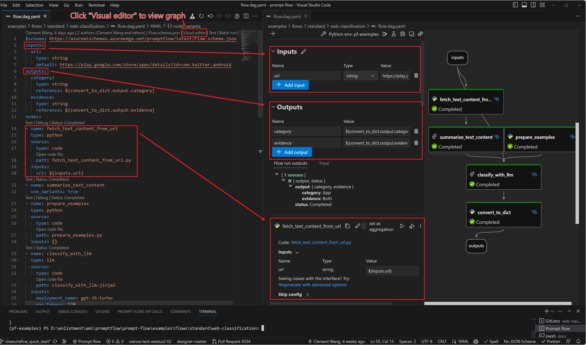
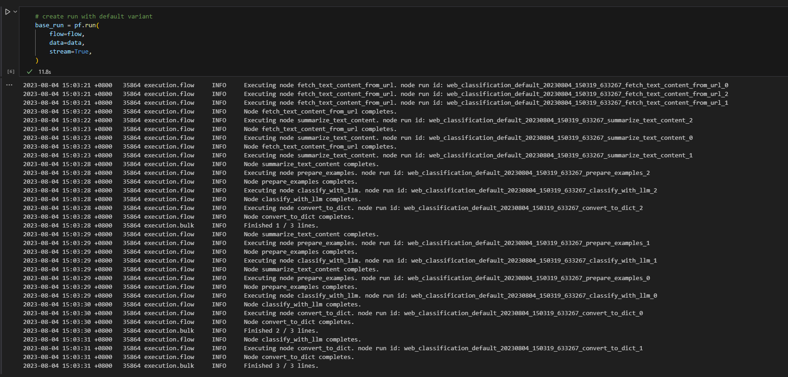
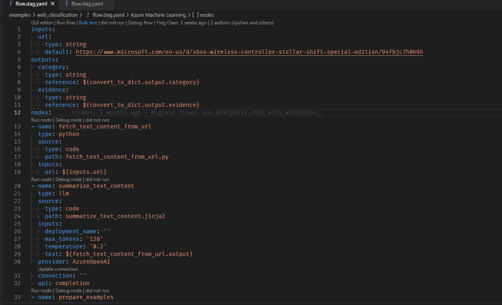

# Quick start

:::{admonition} Experimental feature
This is an experimental feature, and may change at any time. Learn [more](https://aka.ms/azuremlexperimental).
:::

This guide will walk you through the main user journey of prompt flow code-first experience. You will learn how to create and develop your first prompt flow, test and run it with large set of data.

## Prerequisites

1. A python environment, `python=3.9` is recommended.
2. Install `promptflow` and `promptflow-tools`.
```sh
pip install promptflow promptflow-tools --extra-index-url https://azuremlsdktestpypi.azureedge.net/promptflow/
```
3. Get the sample flows. 
   - Get access to the flow sample repository.
        - Make sure you have joined Microsoft org: [Microsoft (github.com)](https://github.com/microsoft)
          - Link to join: [Home | Microsoft Open Source Management](https://repos.opensource.microsoft.com/)
        - Request access to this team: [prompt flow users · microsoft Team (github.com)](https://github.com/orgs/microsoft/teams/prompt-flow-users)
        - Ask a maintainer to approve your request.
    - Clone the sample repo and check flows in folder [examples/flows](https://github.com/microsoft/promptflow/tree/main/examples/flows).
```sh
git clone https://github.com/microsoft/promptflow.git
```

4. (Optional) Prerequisites for VS Code extension.
   - Install latest stable version of [VS Code](https://code.visualstudio.com/)
   - Install [VS Code Python extension](https://marketplace.visualstudio.com/items?itemName=ms-python.python)

5. (Optional) Install Prompt flow VS Code extension
   - <TODO: update extension link in the VS Code extension marketplace>


## Create necessary connections

The connection helps securely store and manage secret keys or other sensitive credentials required for interacting with LLM and other external tools for example Azure Content Safety. See [Manage connections](./manage-connections.md) for more details.

In this guide, we will use flow [web-classification](https://github.com/microsoft/promptflow/tree/main/examples/flows/standard/web-classification) which uses connection `azure_open_ai_connection` inside, we need to set up the connection if we haven't added it before. Once created, the connection will be stored in local db and can be used in any flow.

::::{tab-set}

:::{tab-item} CLI
:sync: CLI

Firstly we need a connection yaml file `connection.yaml`:
```yaml
$schema: https://azuremlschemas.azureedge.net/promptflow/latest/AzureOpenAIConnection.schema.json
name: azure_open_ai_connection
type: azure_open_ai
api_key: <test_key>
api_base: <test_base>
api_type: azure
api_version: <test_version>
```

Then we can use CLI command to create the connection.

```sh
pf connection create -f connection.yaml
```

More command details can be found in [CLI reference](../reference/pf-command-reference.md)

:::
:::{tab-item} SDK
:sync: SDK

In SDK, connections can be created and managed with `PFClient`.

```python
from promptflow import PFClient
from promptflow.entities import AzureOpenAIConnection

# PFClient can help manage your runs and connections.
pf = PFClient()

try:
    conn_name = "azure_open_ai_connection"
    conn = pf.connections.get(name=conn_name)
    print("using existing connection")
except:
    connection = AzureOpenAIConnection(
        name=conn_name,
        api_key="<test_key>",
        api_base="<test_base>",
        api_type="azure",
        api_version="<test_version>",
    )

    conn = pf.connections.create_or_update(connection)
    print("successfully created connection")

print(conn)
```
:::

:::{tab-item} VS Code Extension
:sync: VS Code Extension

Find the "connections" section on the Prompt flow left side bar. The "Create connection" button is on the top right.


:::

::::

## Develop and test your flow
A flow in prompt flow serves as an executable workflow that streamlines the development of your LLM-based AI application. It provides a comprehensive framework for managing data flow and processing within your application. See [Flows](../../concepts/concept-flows.md) for more details.

In this guide, we use [web-classification](https://github.com/microsoft/promptflow/tree/main/examples/flows/standard/web-classification) sample to walk you through the main user journey, it's a flow demonstrating multi-class classification with LLM. Given an url, it will classify the url into one web category with just a few shots, simple summarization and classification prompts.


A flow directory is a directory that contains all contents of a flow. The entry file is `flow.dag.yaml` which describes the DAG(Directed Acyclic Graph) of a flow. The flow dag of this sample likes below:



::::{tab-set}

:::{tab-item} CLI
:sync: CLI


Assuming you are in working directory `<path-to-the-sample-repo>/examples/flows/standard/`

```sh
pf flow test --flow web-classification  # "web-classification" is the directory name
```


:::

:::{tab-item} SDK
:sync: SDK

The return value of `test` function is the flow/node outputs.

```python
from promptflow import PFClient

pf_client = PFClient()

flow_path = "web-classification"  # "web-classification" is the directory name

# Test flow
flow_inputs = {"url": "https://www.youtube.com/watch?v=o5ZQyXaAv1g", "answer": "Channel", "evidence": "Url"}  # The inputs of the flow.
flow_result = pf_client.test(flow=flow_path, inputs=inputs)
print(f"Flow outputs: {flow_result}")

# Test node in the flow
node_name = "fetch_text_content_from_url"  # The node name in the flow.
node_inputs = {"url": "https://www.youtube.com/watch?v=o5ZQyXaAv1g"}  # The inputs of the node.
node_result = pf_client.test(flow=flow_path, inputs=node_inputs, node=node_name)
print(f"Node outputs: {node_result}")
```


:::

:::{tab-item} VS Code Extension
:sync: VS Code Extension

Use the code lens action on the top of the yaml editor to trigger flow test


Click the run flow button on the top of the visual editor to trigger flow test.

:::

::::

See more details in [Initialize and test a flow](./init-and-test-a-flow.md).

## Create a new run

After the flow run successfully with a small set of data, you might want to test if it performs well in large set of data, you can run a batch test and check the outputs.

::::{tab-set}

:::{tab-item} CLI
:sync: CLI

Create the run with flow and data, can add `--stream` to stream the run.
```sh
pf run create --flow web-classification --data web-classification/data.jsonl --stream 
```

You can also name the run by specifying `--name my_first_run` in above command, otherwise the run name will be generated in a certain pattern which has timestamp inside.


With a run name, you can easily view or visualize the run details using below commands:

```sh
pf run show-details -n my_first_run
pf run visualize -n my_first_run
```


More details can be found with `pf run --help`

:::
:::{tab-item} SDK
:sync: SDK

```python
# Set flow path and run input data
flow = "web-classification" # set the flow directory
data= "web-classification/data.jsonl" # set the data file

# create a run, stream it until it's finished
base_run = pf.run(
    flow=flow,
    data=data,
    stream=True,
)

# get the inputs/outputs details of a finished run.
details = pf.get_details(base_run)
details.head(10)

# visualize the run in a web browser
pf.visualize(base_run)
```




:::

:::{tab-item} VS Code Extension
:sync: VS Code Extension
Use the code lens action on the top of the yaml editor to trigger batch run



Click the bulk test button on the top of the visual editor to trigger flow test.

:::

::::

## Next steps

Learn more about:
- [Manage connections](./manage-connections.md)
- [Initialize and test a flow](./init-and-test-a-flow.md)
- [Run and evaluate a flow](./run-and-evaluate-a-flow.md)
- [Tune prompts with variants](./tune-prompts-with-variants.md)
- [Deploy and export a flow](./deploy-and-export-a-flow.md)
- [Prompt flow in Azure AI](../cloud/azureai/quick-start.md)
