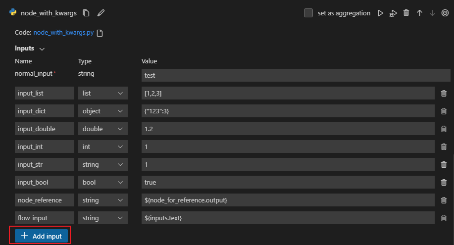

# Python

## Introduction
Users are empowered by the Python Tool to offer customized code snippets as self-contained executable nodes in PromptFlow.
Users can effortlessly create Python tools, edit code, and verify results with ease.

## Inputs

| Name   | Type   | Description                                          | Required |
|--------|--------|------------------------------------------------------|---------|
| Code   | string | Python code snippet                                  | Yes     |
| Inputs | -      | List of tool function parameters and its assignments | -       |


### Types

| Type                                                | Python example                  | Description                                |
|-----------------------------------------------------|---------------------------------|--------------------------------------------|
| int                                                 | param: int                      | Integer type                               |
| bool                                                | param: bool                     | Boolean type                               |
| string                                              | param: str                      | String type                                |
| double                                              | param: float                    | Double type                                |
| list                                                | param: list or param: List[T]   | List type                                  |
| object                                              | param: dict or param: Dict[K, V] | Object type                                |
| [Connection](../../concepts/concept-connections.md) | param: CustomConnection         | Connection type, will be handled specially |


Parameters with `Connection` type annotation will be treated as connection inputs, which means:
- Promptflow extension will show a selector to select the connection.
- During execution time, promptflow will try to find the connection with the name same from parameter value passed in.

Note that `Union[...]` type annotation is supported **ONLY** for connection type,
for example, `param: Union[CustomConnection, OpenAIConnection]`.

## Outputs

The return of the python tool function.


## How to write Python Tool?

### Guidelines

1. Python Tool Code should consist of a complete Python code, including any necessary module imports.

2. Python Tool Code must contain a function decorated with @tool (tool function), serving as the entry point for execution. The @tool decorator should be applied only once within the snippet.

   _Below sample defines python tool "my_python_tool", decorated with @tool_

3. Python tool function parameters must be assigned in 'Inputs' section

    _Below sample defines inputs "message" and assign with "world"_

4. Python tool function shall have return

    _Below sample returns a concatenated string_


### Code

The snippet below shows the basic structure of a tool function. Promptflow will read the function and extract inputs
from function parameters and type annotations.

```python
from promptflow import tool
from promptflow.connections import CustomConnection

# The inputs section will change based on the arguments of the tool function, after you save the code
# Adding type to arguments and return value will help the system show the types properly
# Please update the function name/signature per need
@tool
def my_python_tool(message: str, my_conn: CustomConnection) -> str:
    my_conn_dict = dict(my_conn)
    # Do some function call with my_conn_dict...
    return 'hello ' + message
```

### Inputs

| Name    | Type   | Sample Value in Flow Yaml | Value passed to function|
|---------|--------|-------------------------| ------------------------|
| message | string | "world"                 | "world"                 |
| my_conn | CustomConnection | "my_conn"               | CustomConnection object |

Promptflow will try to find the connection named 'my_conn' during execution time.

### outputs

```python
"hello world"
```


### Keyword Arguments Support
Starting from version 1.0.0 of PromptFlow and version 1.4.0 of [Prompt flow for VS Code](https://marketplace.visualstudio.com/items?itemName=prompt-flow.prompt-flow),
we have introduced support for keyword arguments (kwargs) in the Python tool.


```python
from promptflow import tool


@tool
def print_test(normal_input: str, **kwargs):
    for key, value in kwargs.items():
        print(f"Key {key}'s value is {value}")
    return len(kwargs)

```
When you add `kwargs` in your python tool like above code, you can insert variable number of inputs by the `+Add input` button.

