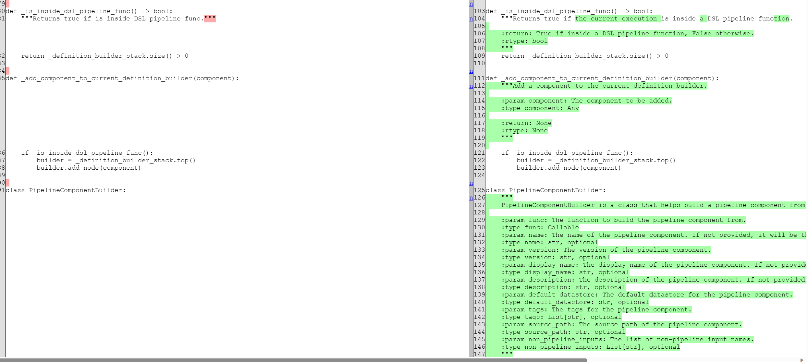

# Auto generate docstring
This example can help you automatically generate Python code's docstring and return the modified code.

Tools used in this flow：
- `load_code` tool, it can load code from a file path.
- `divide_code` tool, it can divide code into code blocks.
- `generate_docstring` tool, it can generate docstring for a code block, and merge docstring into origin code.
- `combine_code` tool, it can merge all code blocks into a code, and return the complete code.

## What you will learn

In this flow, you will learn
- How to compose an auto generate docstring flow.
- How to use different LLM APIs to request LLM, including synchronous/asynchronous APIs, chat/completion APIs.
- How to use asynchronous multiple coroutine approach to request LLM API.
- How to construct a prompt.

## Getting started

### Local execution
#### Create .env file in this folder with below content
```
OPENAI_API_BASE=<AOAI_endpoint>
OPENAI_API_KEY=<AOAI_key>
OPENAI_API_VERSION=2023-03-15-preview
MODULE=gpt-35-turbo # default is gpt-35-turbo.  
```

#### Run the command line
`python main.py --file <your_file_path>`  
**Note**: the file path should be a python file path, default is `./demo_code.py`.

A webpage will be generated, displaying diff:



### Execute with Promptflow
#### Create connection for LLM to use
Go to "Prompt flow" "Connections" tab. Click on "Create" button, select one of LLM tool supported connection types and fill in the configurations.

Currently, there are two connection types supported by LLM tool: "AzureOpenAI" and "OpenAI". If you want to use "AzureOpenAI" connection type, you need to create an Azure OpenAI service first. Please refer to [Azure OpenAI Service](https://azure.microsoft.com/en-us/products/cognitive-services/openai-service/) for more details. If you want to use "OpenAI" connection type, you need to create an OpenAI account first. Please refer to [OpenAI](https://platform.openai.com/) for more details.

```bash
# Override keys with --set to avoid yaml file changes
pf connection create --file azure_openai.yml --set api_key=<your_api_key> api_base=<your_api_base>
```

Note in [flow.dag.yaml](flow.dag.yaml) we are using connection named `azure_open_ai_connection`.
```bash
# show registered connection 
pf connection show --name azure_open_ai_connection
```

#### Start flow

```bash
# run flow with default file path in flow.dag.yaml
pf flow test --flow . 

# run flow with file path
pf flow test --flow . --inputs code_path="./demo_code.py"

# start a interactive chat session in CLI
pf flow test --flow . --interactive

# start a interactive chat session in CLI with verbose info
pf flow test --flow . --interactive --verbose
```

