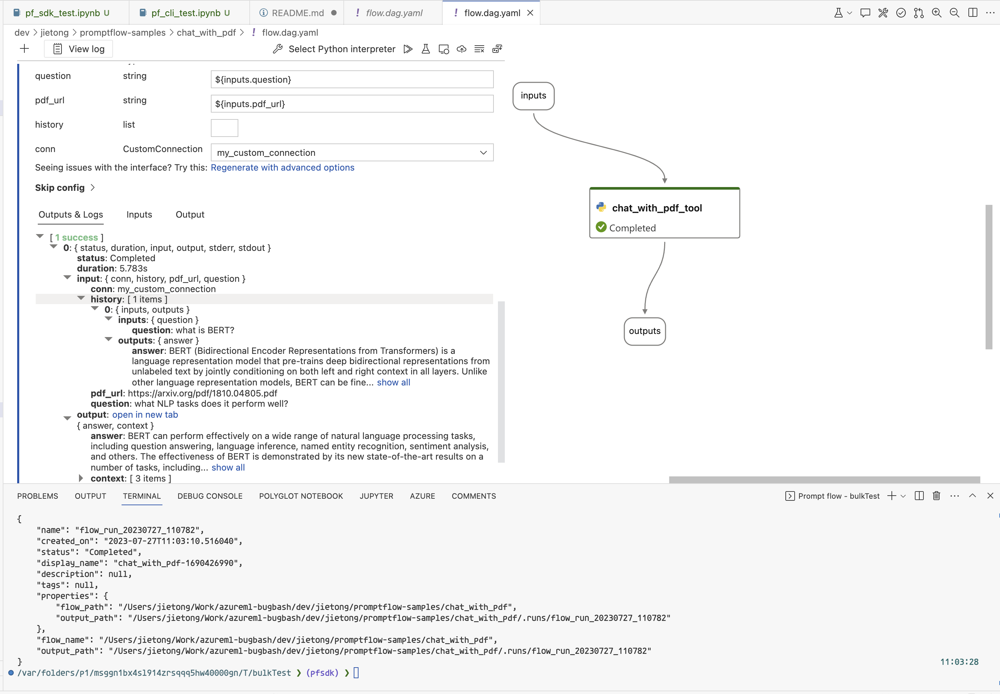

# Chat with PDF

This is a simple flow that allow you to ask questions about the content of a PDF file and get answers.
You can run the flow with a URL to a PDF file and question as argument.
Once it's launched it will download the PDF and build an index of the content. 
Then when you ask a question, it will look up the index to retrieve relevant content and post the question with the relevant content to OpenAI chat model (gpt-3.5-turbo or gpt4) to get an answer.

Tools used in this flow：
- custom `python` Tool


## Prerequisites

Install promptflow sdk and other dependencies:
```bash
pip install -r requirements.txt
```

## Get started
### Create .env file in this folder with below content
```
OPENAI_API_BASE=<AOAI_endpoint>
OPENAI_API_KEY=<AOAI_key>
OPENAI_API_VERSION=2023-03-15-preview
EMBEDDING_MODEL_DEPLOYMENT_NAME=text-embedding-ada-002
CHAT_MODEL_DEPLOYMENT_NAME=gpt-35-turbo
PROMPT_TOKEN_LIMIT=3000
MAX_COMPLETION_TOKENS=256
VERBOSE=false
CHUNK_SIZE=512
CHUNK_OVERLAP=0
```
Note: CHAT_MODEL_DEPLOYMENT_NAME should point to a chat model like gpt-3.5-turbo or gpt-4

```bash
if pf connection list | grep chat_with_pdf_custom_connection; then
    echo "chat_with_pdf_custom_connection already exists"
else
    pf connection create --file .env --name chat_with_pdf_custom_connection
fi
```

### Turn into a prompt flow with just 1 node [flow.dag.yaml](flow.dag.yaml)
Small changes to the code base to turn it into a single-node prompt flow. The benefit is to get a streamlined test, evaluate, debugging, deployment experience.



### CLI Example

```bash
# test with default input value in flow.dag.yaml
pf flow test --flow .

# test with flow inputs
pf flow test --flow . --inputs question="What is the name of the new language representation model introduced in the document?" pdf_url="https://arxiv.org/pdf/1810.04805.pdf"

# (Optional) create a random run name
run_name="web_classification_"$(openssl rand -hex 12)

# run with multiline data, --name is optional
pf run create --flow . --data ./data/bert-paper-qna-3-line.jsonl --stream --name $run_name

# visualize run output details
pf run visualize --name $run_name
```

### SDK Example: Run [pf.ipynb](pf.ipynb)
This is using prompt flow SDK to do evaluation for chat_with_pdf flow, using a test data with 10 questions.
