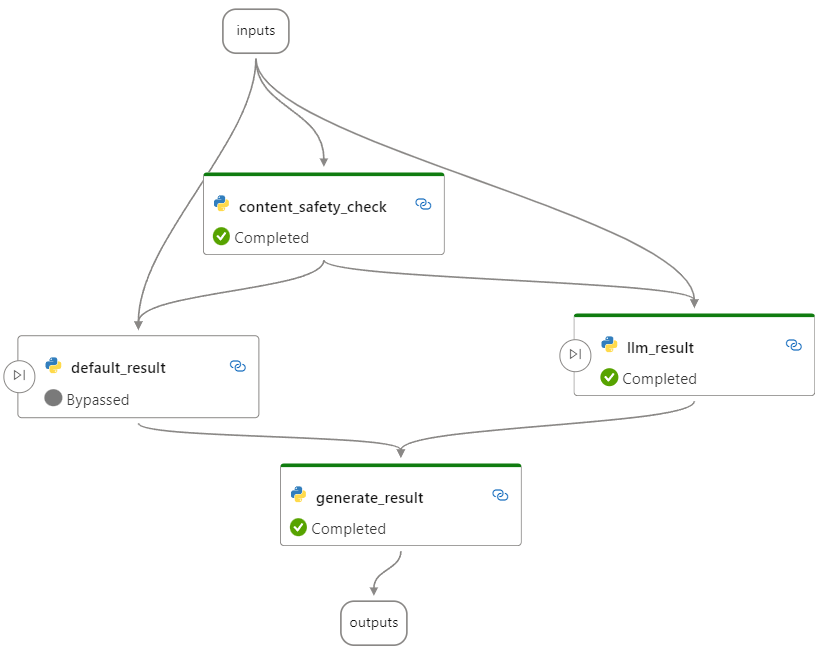
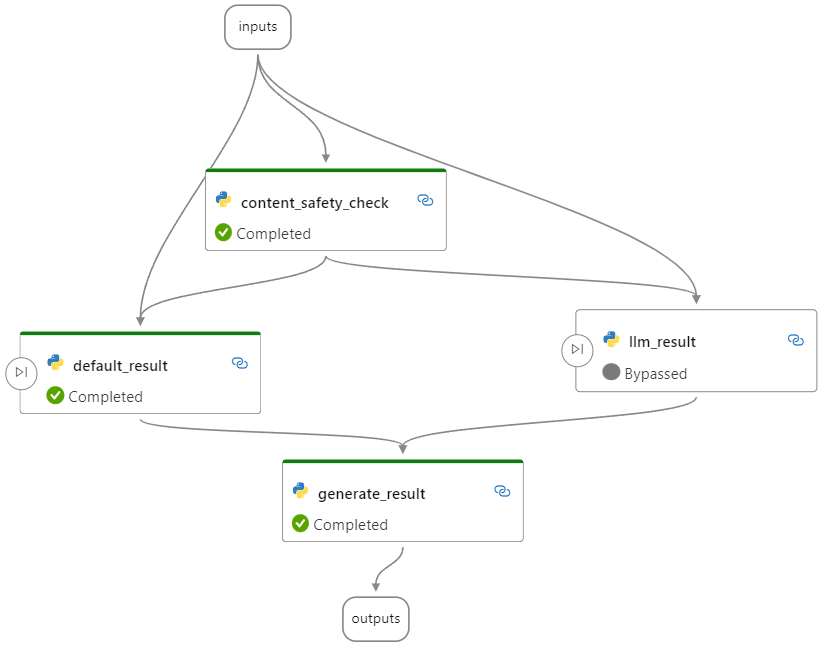

# Conditional flow for if-else scenario

This example is a conditonal flow for if-else scenario.

In this flow, it checks if an input query passes content safety check. If it's denied, we'll return a default response; otherwise, we'll call LLM to get a response and then summarize the final results.

The following are two execution situations of this flow:
- if input query passes content safety check:
  
- else:
  

**Notice**: The `content_safety_check` and `llm_result` node in this flow are dummy nodes that do not actually use the conten safety tool and LLM tool. You can replace them with the real ones. Learn more: [LLM Tool](https://microsoft.github.io/promptflow/reference/tools-reference/llm-tool.html)

By following this example, you will learn how to create a conditional flow using the `activate config`.

## Prerequisites

Install promptflow sdk and other dependencies:
```bash
pip install -r requirements.txt
```

## Run flow

- Test flow
```bash
# test with default input value in flow.dag.yaml
pf flow test --flow .

# test with flow inputs
pf flow test --flow . --inputs question="What is Prompt flow?"
```

- Create run with multiple lines of data
```bash
# create a random run name
run_name="conditional_flow_for_if_else_"$(openssl rand -hex 12)

# create run
pf run create --flow . --data ./data.jsonl --stream --name $run_name
```

- List and show run metadata
```bash
# list created run
pf run list

# show specific run detail
pf run show --name $run_name

# show output
pf run show-details --name $run_name

# visualize run in browser
pf run visualize --name $run_name
```
