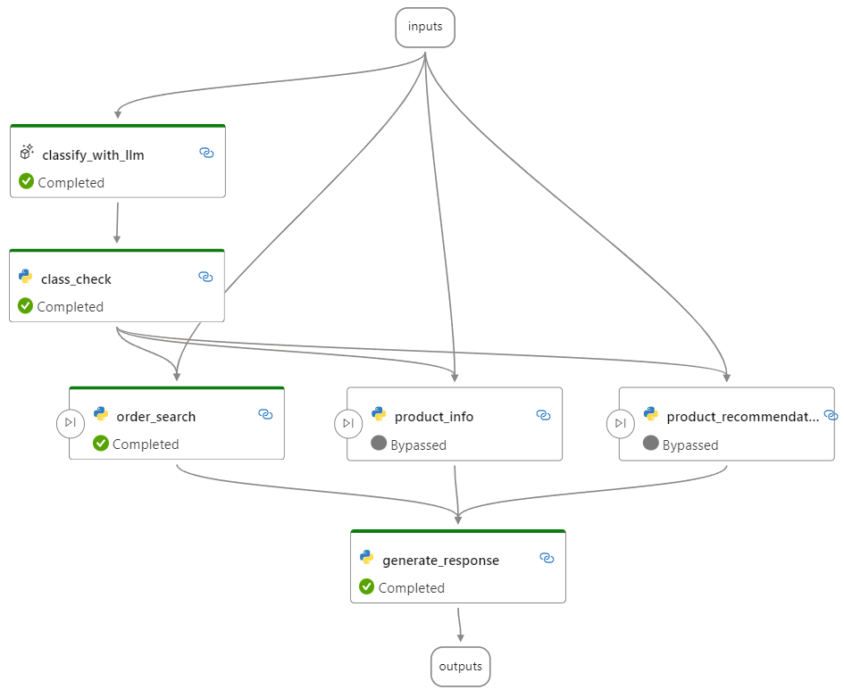

# Conditional flow for switch scenario

This example is a conditional flow for switch scenario.

By following this example, you will learn how to create a conditional flow using the `activate config`.

## Flow description

In this flow, we set the background to the search function of a certain mall, use `activate config` to implement switch logic and determine user intent based on the input queries to achieve dynamic processing and generate user-oriented output.

- The `classify_with_llm` node analyzes user intent based on input query and provides one of the following results: "product_recommendation," "order_search," or "product_info".
- The `class_check` node generates the correctly formatted user intent.
- The `product_recommendation`, `order_search`, and `product_information` nodes are configured with activate config and are only executed when the output from `class_check` meets the specified conditions.
- The `generate_response` node generates user-facing output.



## Prerequisites

Install promptflow sdk and other dependencies:
```bash
pip install -r requirements.txt
```

## Setup connection

Prepare your Azure Open AI resource follow this [instruction](https://learn.microsoft.com/en-us/azure/cognitive-services/openai/how-to/create-resource?pivots=web-portal) and get your `api_key` if you don't have one.

Note in this example, we are using [chat api](https://learn.microsoft.com/en-us/azure/ai-services/openai/how-to/chatgpt?pivots=programming-language-chat-completions), please use `gpt-35-turbo` or `gpt-4` model deployment.

Create connection if you haven't done that. Ensure you have put your azure open ai endpoint key in [azure_openai.yml](../../../connections/azure_openai.yml) file.
```bash
# Override keys with --set to avoid yaml file changes
pf connection create -f ../../../connections/azure_openai.yml --name open_ai_connection --set api_key=<your_api_key> api_base=<your_api_base>
```

Note in [flow.dag.yaml](flow.dag.yaml) we are using connection named `open_ai_connection`.
```bash
# show registered connection
pf connection show --name open_ai_connection
```

## Run flow

- Test flow
```bash
# test with default input value in flow.dag.yaml
pf flow test --flow .

# test with flow inputs
pf flow test --flow . --inputs query="When will my order be shipped?"
```

- Create run with multiple lines of data
```bash
# create a random run name
run_name="conditional_flow_for_switch_"$(openssl rand -hex 12)

# create run
pf run create --flow . --data ./data.jsonl --column-mapping query='${data.query}' --stream --name $run_name
```

- List and show run metadata
```bash
# list created run
pf run list

# show specific run detail
pf run show --name $run_name

# show output
pf run show-details --name $run_name

# visualize run in browser
pf run visualize --name $run_name
```
