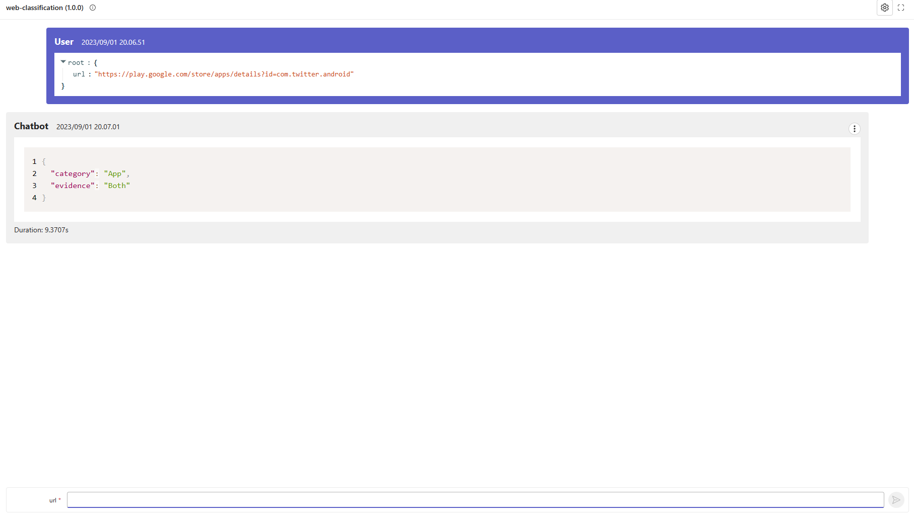

# Deploy flow using Azure App Service

This example demos how to deploy a flow using Azure App Service.

[Azure App Service](https://learn.microsoft.com/azure/app-service/) is an HTTP-based service for hosting web applications, REST APIs, and mobile back ends.
The scripts (`deploy.sh` for bash and `deploy.ps1` for powershell) under this folder are here to help deploy the docker image to Azure App Service.

We will use [web-classification](../../flows/standard/web-classification/README.md) as example in this tutorial.

## Build a flow as docker format app

Use the command below to build a flow as docker format app:

```bash
pf flow build --source ../../flows/standard/web-classification --output build --format docker
```

Note that all dependent connections must be created before building as docker.

## Deploy with Azure App Service
The two scripts will do the following things:
1. Create a resource group if not exists.
2. Build and push the image to docker registry.
3. Create an app service plan with the give sku.
4. Create an app with specified name, set the deployment container image to the pushed docker image.
5. Set up the environment variables for the app.

Example command to use bash script:
```shell
bash deploy.sh --path build -i <image_tag> --name my_app_23d8m -r <docker registery> -g <resource_group>
```

Example command to use powershell script:
```powershell
.\deploy.ps1 -i <image_tag> --Name my_app_23d8m -r <docker registery> -g <resource_group>
```
Note that the `name` will produce a unique FQDN as AppName.azurewebsites.net.

See the full parameters by `bash deploy.sh -h` or `.\deploy.ps1 -h`.

## View and test the web app
The web app can be found via [azure portal](https://ms.portal.azure.com/) 


After the app created, you will need to go to https://ms.portal.azure.com/ find the app and set up the environment variables
at (Settings>Configuration) or (Settings>Environment variables), then restart the app.


Browse the app at Overview and see the test page:



Tips:
- Reach deployment logs at (Deployment>Deployment Central) and app logs at (Monitoring>Log stream).
- Reach advanced deployment tools at https://$name.scm.azurewebsites.net/.
- Reach more details about app service at https://learn.microsoft.com/azure/app-service/.