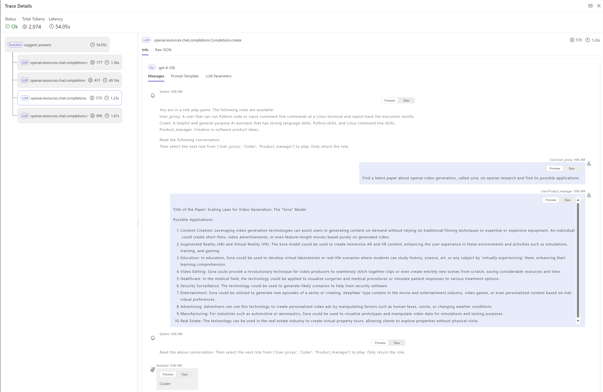
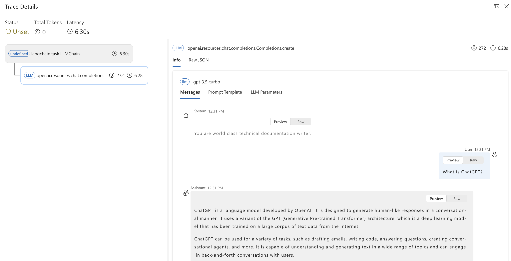
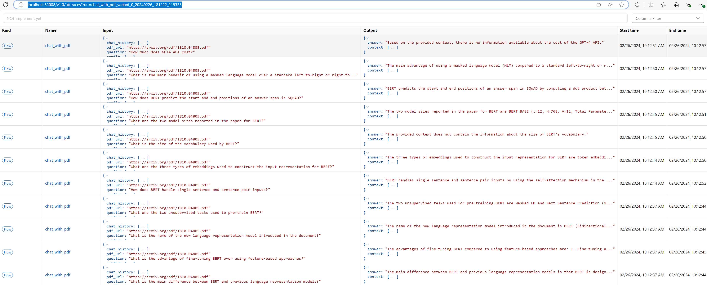

## Installation
* Install promptflow private wheel:
```cmd
pip install "promptflow==0.0.120619417" --extra-index-url https://azuremlsdktestpypi.azureedge.net/promptflow/
```
* Enable internal features in your conda env
```cmd
pf config set enable_internal_features=true
```

## Traces
Today, DAG prompt flow has a way to track and visualize node level inputs/outputs of flow execution, it provides critical insights for developer to understand the internal details of execution. While more developers are using different frameworks (langchain, semantic kernel, OpenAI, kinds of agents) to create LLM based applications. To benefit these non-DAG-flow developers, prompt flow provides the trace feature to capture and visualize the internal execution details. 
### LLM Trace
#### **`start_trace()` to enable trace for LLM calls**
Let's start with the simplest example, add single line code to enable trace for LLM calls in your application.
```python
from openai import OpenAI
from promptflow.tracing import start_trace

# start_trace() will print a url for trace detail visualization 
start_trace()

client = OpenAI()

completion = client.chat.completions.create(
  model="gpt-4",
  messages=[
    {"role": "system", "content": "You are a poetic assistant, skilled in explaining complex programming concepts with creative flair."},
    {"role": "user", "content": "Compose a poem that explains the concept of recursion in programming."}
  ]
)

print(completion.choices[0].message)
```

With the trace url, user will see a trace list that corresponding to each LLM calls:


Click on line record, the LLM detail will be displayed with chat window experience, together with other LLM call params:


More case of adding trace for autogen and langchain:

1. **[Add trace for Autogen](./autogen-groupchat/)**



2. **[Add trace for Langchain](./langchain)**



#### **`@trace` to allow you trace for any function**
More common scenario is the application has complicated code structure, and developer would like to add trace on critical path that they would like to debug and monitor. 

See the **[math_to_code](./math_to_code.py)** example. Execute `python math_to_code.py` will get an URL to display the trace records and trace details of each test.


### Flow Traces
If your application is created with DAG flow, all flow test and batch run will be automatically enable trace function. Take the **[chat_with_pdf](../../flows/chat/chat-with-pdf/)** as example. Run `pf flow test --flow .`, each flow test will generate single line in the trace UI:


Click a record, the trace details will be visualized as tree view.


### Evaluate against batch data
Keep using **[chat_with_pdf](../../flows/chat/chat-with-pdf/)** as example, to trigger a batch run, you can use below commands:

```cmd
pf run create -f batch_run.yaml
```
Or
```cmd
pf run create --flow . --data "./data/bert-paper-qna.jsonl" --column-mapping chat_history='${data.chat_history}' pdf_url='${data.pdf_url}' question='${data.question}'
```
Then you will get a run related trace URL, e.g. http://localhost:52008/v1.0/ui/traces?run=chat_with_pdf_variant_0_20240226_181222_219335

