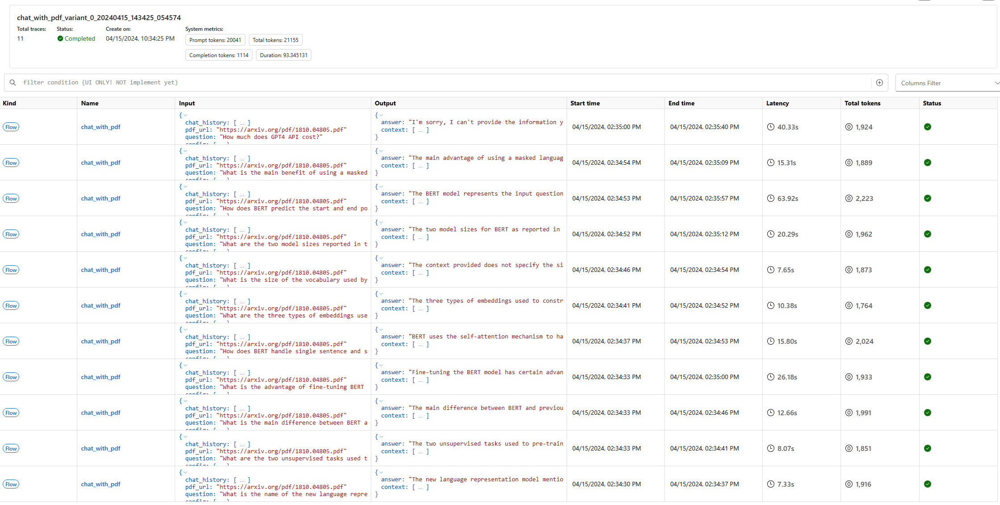

## Tracing

Prompt flow provides the tracing feature to capture and visualize the internal execution details for all flows.

For `DAG flow`, user can track and visualize node level inputs/outputs of flow execution, it provides critical insights for developer to understand the internal details of execution. 

For `Flex flow` developers, who might use different frameworks (langchain, semantic kernel, OpenAI, kinds of agents) to create LLM based applications, prompt flow allow user to instrument their code in a [OpenTelemetry](https://opentelemetry.io/) compatible way, and visualize using UI provided by promptflow devkit.

## Instrumenting user's code
#### `start_trace()` to enable trace for LLM calls
Let's start with the simplest example, add single line code to enable trace for LLM calls in your application.
```python
from openai import OpenAI
from promptflow.tracing import start_trace

# start_trace() will print a url for trace detail visualization 
start_trace()

client = OpenAI()

completion = client.chat.completions.create(
  model="gpt-4",
  messages=[
    {"role": "system", "content": "You are a poetic assistant, skilled in explaining complex programming concepts with creative flair."},
    {"role": "user", "content": "Compose a poem that explains the concept of recursion in programming."}
  ]
)

print(completion.choices[0].message)
```

With the trace url, user will see a trace list that corresponding to each LLM calls:


Click on line record, the LLM detail will be displayed with chat window experience, together with other LLM call params:


More examples of adding trace for [autogen](https://microsoft.github.io/autogen/) and [langchain](https://python.langchain.com/docs/get_started/introduction/):

1. **[Add trace for Autogen](./autogen-groupchat/)**


2. **[Add trace for Langchain](./langchain)**


#### `@trace` to allow you trace for any function
More common scenario is the application has complicated code structure, and developer would like to add trace on critical path that they would like to debug and monitor. 

See the **[math_to_code](./math_to_code.py)** example. 

```python
from promptflow.tracing import trace
# trace your function
@trace
def code_gen(client: AzureOpenAI, question: str) -> str:
    sys_prompt = (
        "I want you to act as a Math expert specializing in Algebra, Geometry, and Calculus. "
        "Given the question, develop python code to model the user's question. "
        "Make sure only reply the executable code, no other words."
    )
    completion = client.chat.completions.create(
        model=os.getenv("CHAT_DEPLOYMENT_NAME", "gpt-35-turbo"),
        messages=[
            {
                "role": "system",
                "content": sys_prompt,
            },
            {"role": "user", "content": question},
        ],
    )
    raw_code = completion.choices[0].message.content
    result = code_refine(raw_code)
    return result
```

Execute below command will get an URL to display the trace records and trace details of each test.

```bash
python math_to_code.py
```

## Trace visualization in flow test and batch run
### Flow test

If your application is created with DAG flow, all flow test and batch run will be automatically enable trace function. Take the **[chat_with_pdf](../../flows/chat/chat-with-pdf/)** as example. 

Run `pf flow test --flow .`, each flow test will generate single line in the trace UI:


Click a record, the trace details will be visualized as tree view.


### Evaluate against batch data
Keep using **[chat_with_pdf](../../flows/chat/chat-with-pdf/)** as example, to trigger a batch run, you can use below commands:

```shell
pf run create -f batch_run.yaml
```
Or
```shell
pf run create --flow . --data "./data/bert-paper-qna.jsonl" --column-mapping chat_history='${data.chat_history}' pdf_url='${data.pdf_url}' question='${data.question}'
```
Then you will get a run related trace URL, e.g. http://localhost:52008/v1.0/ui/traces?run=chat_with_pdf_variant_0_20240226_181222_219335

